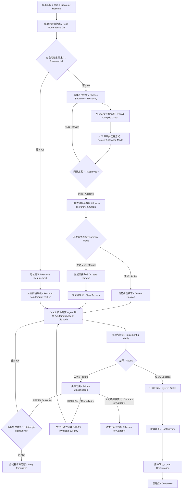

# Layered Delivery

面向 AI Agent 的分层交付治理 Skill。它使用 Python 3.10+ 标准库控制器，把人工评审的交付层级编译成“执行图 + 治理图”，让软件需求可恢复、可调度、可机械门禁，并以 SQLite 保存唯一机器状态。

当前只维护完整 schema v3。项目不依赖 Node、npm、第三方 Python 包或全局 CLI，也不提供旧 JSON 工作区或旧 schema 的迁移与兼容入口。

## 核心契约

- 合法结构只有根 `Task`、`Capability → Task`、`Delivery → Capability → Task`。
- 使用满足真实聚合责任的最浅结构；Task 是唯一执行叶子。
- 一个用户需求在 `work-items/` 下只有一个顶层目录，子节点按真实父子关系递归放入 `children/`。
- 根级 `development-plan.md` 是整棵需求树唯一的冻结评审入口，一次人工确认冻结全部节点。
- 层级由用户评审，Delivery Graph 由控制器确定性编译；用户不直接维护任意节点和边。
- Task execution、各级 gate、root review 和 user confirmation 都是显式图节点。
- 冻结的依赖合同是 DAG；运行时由有限状态机和路由策略驱动，允许受控重试、回退、暂停与恢复。因此完整 Graph Engineering 不是“只有 DAG”。
- `ready-tasks` 是 graph frontier 的 Task 投影；冻结图定义运行合同，带图指纹的哈希事件链是运行事实，graph run 和 node attempt 是可由事件完整重建的查询快照。
- `graph-frontier.dispatchPlan` 自动计算完整安全 Task 集合、稳定顺序和目标 Agent 数；执行平台只能立即启动或按原顺序排队，不能挑选子集。
- 项目级 `.layered-delivery/governance.sqlite3` 是唯一机器权威，Markdown 只是可重建的人类投影。
- 同一冻结目标和验收契约内的修正必须回到原 Task，不得为修复同一需求创建第二个根。
- Agent 不自动提交、推送、合并、迁移、发布或改变外部状态；这些动作需要单独明确授权。

## 人工参与边界

人在正常流程中只参与前后两个阶段：

1. 前段查看根级 `development-plan.md`，讨论需求和完整开发方案，选择一次 `active` 或 `manual` 并明确确认冻结；
2. 末段在根工作项门禁、独立审查和交付完成后，进行最终验收与确认。

人工不需要知道、复制或复述层级指纹，也不逐 Task 批准、交接或回复启动。冻结后的 READY、目标 Agent 数、自动派发、工程门禁、失败分类、回归、修复、复测和恢复由 Graph 管理。执行平台只提供 Agent/队列容量，不拥有任务选择或失败路由决策权。

## 层级选择

| 最浅合法结构 | 适用场景 | 责任边界 |
|---|---|---|
| `Task` | 一个可独立开发和验收的结果 | Task 直接执行与门禁 |
| `Capability → Task` | 多个 Task 需要共享契约、依赖或集成门禁 | Capability 聚合，Task 执行 |
| `Delivery → Capability → Task` | 多个 Capability 需要跨能力约束或顶层交付门禁 | Delivery 顶层聚合，Capability 分组，Task 执行 |

文件数量、接口数量、仓库大小或风险等级不能单独推出更深层级。不允许 `Delivery → Task`、`Capability → Capability`、平铺子包或声明但不物化的 child。事实不足时先补齐交付边界、执行叶子、依赖和聚合验收责任，不创建运行包。

## 完整工作流



正常新需求的控制器顺序为：

```text
prepare-hierarchy
→ 人工评审需求级 development-plan.md + execution-graph.md，并查看工作区级 state-transition-graph.md；选择 active/manual
→ freeze-hierarchy
→ graph-frontier / 读取 dispatchPlan / 自动 dispatch-task
→ task-result / development-review.md
→ 必要时 remediate-task 回到原 Task
→ accept-item / acceptance-report.md
→ acceptance-item / 用户最终确认
```

## 准备与一次冻结

启动时先从当前 Skill 元数据解析 `<skill-root>`（当前已加载 `SKILL.md` 所在目录），再验证控制器入口：

```text
python -X utf8 <skill-root>/scripts/hdg.py --help
```

`<skill-root>` 是宿主无关的逻辑占位符，不是固定目录。执行时可以解析成本机绝对路径，但不能根据用户名、用户主目录、`.claude`、`.codex` 或操作系统猜测安装位置，也不能把解析结果固化到交接命令、冻结方案或治理状态。控制器从被治理项目根目录运行，协议不按操作系统分叉。

新需求使用 schema v3 的完整嵌套 definition，通过 stdin 一次准备整棵树：

```json
{"schemaVersion":3,"root":{"definition":{"...":"完整根节点定义"},"children":[]}}
```

```text
python -X utf8 <skill-root>/scripts/hdg.py prepare-hierarchy --definition - --host-runtime <agent> --json
```

准备只生成待评审方案，不授权开发。Agent 应向用户展示根 ID、层级、开发目的、精确文件、接口或共享契约、依赖波次和测试映射，并提供根级 `development-plan.md`。方案修改后重新准备同一个完整需求树。每次准备或修订返回的 `responseContract` 都要求确认提示同时保留 `active` 和 `manual`，不能因为反复修改而省略某种方式。

用户明确同意当前方案并选择开发方式后，Agent 使用准备结果中的当前指纹一次冻结：

```text
python -X utf8 <skill-root>/scripts/hdg.py freeze-hierarchy --item <root-id> --expected-hierarchy <fingerprint> --development-mode active|manual --confirmed --json
```

计划或指纹变化后，旧确认必须被拒绝。开发方式与整棵树同时冻结，不能在同一冻结需求上原地切换。

## 开发方式

### active

当前会话冻结后立即启动 Graph 执行循环。Graph 根据依赖、写入冲突和活动 claim 生成 `dispatchPlan`，自动决定完整 Task 顺序与目标 Agent 数。执行平台按计划启动隔离子 Agent；容量不足时稳定排队或由当前 Agent 串行消费，不重新询问开发方式。

当前宿主是 Claude Code 时，`prepare-hierarchy` 会返回 `hostAutomation`。用户选择 active 前必须通过用户级设置、模式选择器或 `--permission-mode auto` 启用 Auto；`acceptEdits` 仍会为测试和控制器进程请求 Process 授权，不能在 Task 已认领后再等待配置权限。

### manual

规划会话冻结后不修改业务代码。控制器同时提供：

- `requirement-handoff.md`：完整需求级交接文档；
- `handoffPrompt`：与完整交接文档相同的内容；
- `handoffCommand`：可直接复制到新任务的简短指令；
- `claudeCodeAutoHandoff`：交接到 Claude Code 时使用的 Desktop 提示、交互式 Auto 命令和 `-p` 无人值守命令。

manual 冻结后的首次最终回复必须按 `responseContract` 给出可一次复制到其他 Agent 的纯文本代码块。可以直接使用 `handoffCommand`，也可以提供覆盖 `requiredSemantics` 的语义等价文本，不要求逐字一致；不能只给 `requirement-handoff.md` 链接，也不能要求用户打开文件后补充复制。文件链接放在代码块之后，仅用于查看完整交接与冻结方案。

```text
继续执行治理需求 <root-id>。使用当前 layered-delivery Skill 从当前 Skill 元数据解析控制器入口，从当前项目的治理数据库恢复已冻结方案，按 Graph 自动调度计划接管整棵需求树并完成开发、测试和门禁；以 graph-frontier 为恢复入口并直接消费控制器 JSON 输出，不固化用户目录、Skill 安装位置或操作系统路径，不使用临时 JSON 中转，也不要重新准备、冻结需求或逐 Task 请求人工启动。
```

新会话收到一次交接后成为整树 Graph 执行入口。它从 `graph-frontier` 读取控制器自动计算的 READY 与 `dispatchPlan`，按完整顺序逐 Task `dispatch-task`，不要求人工逐项启动，也不自行挑选 Task。`task-context` 只用于诊断预览，不能替代恢复或正式派发。

Claude Code 的权限模式不能由聊天提示或仓库项目设置切换。长期使用可由用户在用户级 settings 中把 `permissions.defaultMode` 设为 `auto`；单次 CLI 交接可直接使用 `claudeCodeAutoHandoff.unattendedCommand`。不默认使用只适合隔离环境的 `bypassPermissions`。详见 [Claude Code 自动执行与权限前置条件](skills/layered-delivery/references/claude-automation.md)。

## 开发、写回与门禁

Graph 执行循环从 frontier 自动调度依赖已验证、路径不冲突且实际可访问的 READY Task。每个 Task 使用独立的 owner、operationId、attempt、上下文、授权文件、结果和门禁证据：

```text
dispatch-task
→ 实现
→ 回归测试
→ 修复与复测
→ task-result: IMPLEMENTED | BLOCKED
→ development-review.md
→ accept-item
→ acceptance-report.md
```

- `IMPLEMENTED` 只表示开发结果已写回并等待门禁，不表示 PASS。
- `BLOCKED` 必须携带结构化 `failure.class/code/summary`。`RETRYABLE` 和租约失联 `WORKER_LOST` 在最多 3 次尝试内由控制器自动创建新 attempt；耗尽后写入 `RETRY_EXHAUSTED` 并阻断。
- `CONTRACT_CHANGE`、`EXTERNAL_AUTHORITY`、`NON_RETRYABLE` 和 `REMEDIATION_REQUIRED` 只进入对应人工或修正路由，不被错误地自动重跑。
- 活动 claim 使用 30 分钟租约；执行者用 `heartbeat-task` 续租。`advance-graph` 会机械识别过期 claim，并按 `WORKER_LOST` 路由恢复。
- Task 通过后为 `VERIFIED`；Capability 和 Delivery 必须等直接子级全部 VERIFIED 后运行自己的聚合门禁，不能因子级全绿自动 PASS。
- 同 baseline 且没有活动 claim 的 `BLOCKED` 可用 `retry-item` 自动恢复并继续。
- 测试、范围、验收项或证据不完整时门禁不能 PASS；P0/P1 必须为空，P2 必须展示。
- 根 gate PASS 后仍需独立只读审查或人工审查，再由用户单独最终确认；只有 `COMPLETED` 表示需求完成。

### 同一 Task 的验证修正

若回归、门禁、独立审查或最终验收发现冻结方案漏列了完成原验收项所需的精确文件，并且目标、需求、验收、接口行为、数据契约、拓扑和外部授权都未改变，Graph 执行循环按 `REMEDIATION_REQUIRED` 路由使用 `remediate-task --evidence -` 在原 Task 追加授权。

控制器保持原 baseline、层级指纹、图指纹和 `development-plan.md` 不变，记录修正原因、关联验收项和补充文件，并从该 Task execution 沿显式图边失效必要后继与聚合 gate，再创建新的 node attempt。只有契约或授权事实确实变化时才回到人工评审；不得通过重新 `prepare-hierarchy` 创建重复需求根。

## SQLite 权威与可读投影

每个项目只有一个机器权威：

```text
.layered-delivery/governance.sqlite3
```

它保存全部需求的工作项、层级、冻结状态、Task 上下文、claim、operationId、完整 evidence、开发复核、验收报告和交互事件。多个需求通过根工作项 ID 隔离，不为每个 `<root-id>` 建库。

人类可读文件由 SQLite 和控制器当前 schema v3 的共享 runtime 策略重建：

```text
.layered-delivery/
├── governance.sqlite3                 # 唯一机器权威，schema v3
├── workspace-overview.md              # 按最近更新时间倒序的全局需求索引
├── state-transition-graph.md          # 工作区共享的开发流程 + 运行时 FSM + 路由契约
├── assets/
│   ├── development-flow.svg           # 工作区共享运行时投影
│   └── node-state-machine.svg
├── workspace-overview/
│   ├── YYYY-MM.md                     # 月度索引
│   └── YYYY-MM/
│       └── <root-id>.md               # 单需求完整层级明细
└── work-items/
    └── <root-id>/                     # 一个需求只有一个顶层目录
        ├── baseline.md
        ├── development-plan.md        # 整树冻结评审入口
        ├── execution-graph.md         # 嵌入 SVG 的执行图 + 治理图双语投影
        ├── assets/
        │   ├── execution-graph.svg
        │   └── governance-graph.svg
        ├── frontier.md                # 自动 Agent 计划、关键路径、迁移、预算、建议动作与阻断看板
        ├── run-timeline.md            # attempt、迁移、失败分类、租约与事件链
        ├── progress.md                # 整树总进度
        ├── node-progress.md           # 根节点自身进度
        ├── interaction-log.md         # 可审计交互摘要
        ├── requirement-handoff.md     # 仅 manual 冻结后生成
        ├── development-review.md      # 开发结果写回后生成
        ├── acceptance-report.md       # 门禁后生成并持续更新
        └── children/
            └── <child-id>/
                ├── baseline.md
                ├── development-plan.md
                ├── progress.md        # 子节点自身进度
                └── children/...
```

核心阅读入口是：

```text
冻结前：development-plan.md
图结构：execution-graph.md
运行与失败路由：.layered-delivery/state-transition-graph.md（工作区共享）
下一步与关键路径：frontier.md
运行过程：run-timeline.md
开发结果写回后：development-review.md
门禁执行后：acceptance-report.md
```

根 `progress.md` 以表格保持与方案相同的节点顺序和层级，并分别展示阶段、状态、门禁、当前执行、节点文件和阶段产物。“当前执行”对协调节点显示“不适用”，对未认领 Task 显示“未认领”，活动 Task 显示 `owner / operationId`，结果写回后显示“已释放”。根节点进度链接 `node-progress.md`，不能回链整树 `progress.md`。

`workspace-overview.md` 只保留稳定根 ID 的全局索引，并直接链接同级共享的 `state-transition-graph.md`；月度和单需求明细写入 `workspace-overview/`。显示时间使用运行时本机时区，SQLite 原始时间保持 UTC；完成日期只能来自最终用户确认后的 `COMPLETED`。

Markdown 不是机器权威。手工删除需求目录不会删除 SQLite 状态，后续刷新还会重建，因此不能用删除文件代替治理状态操作。

## 恢复、隔离与交互审计

- 恢复优先使用用户给出的精确 ID 或路径，其次使用有效焦点或唯一候选；存在多个候选时请求用户选择。
- 数据库 schema、协调根、ID、拓扑、路径、普通字段或指纹损坏时阻断，不迁移、不猜测。
- 仅当历史节点只有 evidence 引用过期、完整 artifact 仍在 SQLite 且其他契约有效时，控制器将该节点只读隔离；它不能被直接操作，但不阻断新需求、有效兄弟 Task 或已有 claim。
- Markdown 投影缺失时使用 `refresh-projections` 从 SQLite 重建，不能从 Markdown 反向猜测机器状态。
- `graph-replay` 从完整事件链重算所有 node attempt、图状态与回放指纹，并检查查询快照是否一致；只有确认快照损坏时，才使用带 `--confirmed` 的 `rebuild-graph-run` 重建 `graph_runs/node_runs`。
- `record-interaction` 只记录必要的用户指令、Agent 更新、决策或状态摘要；`interaction-log` 查询结构化事件，根级 `interaction-log.md` 供人工审计。
- 交互记录不得保存隐藏思考过程、密钥或不必要的原始对话。

旧 JSON 控制目录、旧 schema 和路径式 evidence 不迁移、不兼容。

## 控制器调用与结构化传输

只读查询的 JSON 直接写到 stdout。Agent 不得把 `graph-frontier`、`task-context` 等查询结果先写入临时 JSON 再读取；控制器非零退出时必须保留 stderr 并停止解析，不能让下游 `JSONDecodeError` 遮蔽真正错误。

以下结构化数据只能通过 stdin 直接提交：

- `prepare-hierarchy --definition -`
- `record-interaction --interaction -`
- `task-result`、`remediate-task`、`gate-item`、`accept-item`、`acceptance-item` 的 `--evidence -`

控制器拒绝文件路径，不生成 `_hdg_*.json`、`.hdg-tmp/**`、系统 `%TEMP%` 或其他中间 JSON。完整 artifact 与控制器计算的规范 JSON SHA-256 在同一 SQLite 写事务内保存；图事件证据还会由控制器绑定 `runId/nodeId/attempt/graphFingerprint`，形成不可移植到其他节点或尝试的 bound evidence。Agent 不直接写数据库，也不提供自算摘要或绑定字段。

宿主使用当前 shell 原生支持的 stdin 直连能力，不再嵌套另一个 shell。heredoc 与 here-string 只是按 shell 能力区分的适配方式，不是操作系统分支。完整的宿主无关契约与示例见 [stdin-transport.md](skills/layered-delivery/references/stdin-transport.md)。

## 开发与安全边界

- Task 只能修改冻结的 `developmentPlan.fileChanges` 和控制器通过验证修正追加的精确文件；scope 不是任意写授权。
- Task 上下文不继承需求分析、其他 Task 对话或宿主隐式记忆，必须从 SQLite 重建。
- 开发 Agent 不修改 SQLite、baseline、治理投影或 `.git/**`。
- 控制器缺失、版本不符或机械校验失败时保持阻断，不用对话或“等价流程”绕过。
- 外部提交、推送、合并、迁移、发布和公开动作必须另行授权。

## 多仓库与多服务

当前控制器只维护一个协调根。跨仓库或多服务需求的所有文件必须能从协调根以安全相对路径访问，控制面只存在于协调根的 `.layered-delivery/`，不能复制到各子仓库。

每个 Task 的 `scope` 和 `fileChanges` 应包含仓库目录；测试从协调根执行；提供方与消费方通过 `dependsOn` 表达先后关系；跨服务接口、schema、事件或配置进入父级 `sharedContracts`。无法从协调根安全访问的路径必须在准备需求树前阻断。

## 安装

仓库提供标准库安装器，可同时更新 Codex 和 Claude：

```text
python scripts/install_skill.py --target both --scope user --dry-run
python scripts/install_skill.py --target both --scope user --force
```

也可以只安装一个宿主：

```text
python scripts/install_skill.py --target codex --scope user --force
python scripts/install_skill.py --target claude --scope user --force
```

安装后从当前 Skill 元数据解析实际目录并运行控制器，不能依赖旧副本、固定用户目录或全局命令：

```text
python -X utf8 <skill-root>/scripts/hdg.py --help
```

## 当前控制命令

| 命令 | 作用 |
|---|---|
| `prepare-hierarchy` | 通过 stdin 准备完整需求树，生成整树和节点方案及进度 |
| `freeze-hierarchy` | 用一次人工确认冻结整棵树并记录 active/manual |
| `ready-tasks` | 动态计算根或子树中当前可调度 Task |
| `graph-status` | 查询完整图、节点状态、attempt 和 graph run |
| `graph-frontier` | 查询当前允许动作、自动 Agent 调度计划与结构化阻断原因 |
| `graph-events` | 查询带前序哈希校验的运行事件链 |
| `graph-replay` | 从完整事件链重算运行状态并检查快照一致性 |
| `rebuild-graph-run` | 经显式确认后按事件回放重建 graph/node run 查询快照 |
| `advance-graph` | 执行确定性自动路由，包括过期 claim 的失联恢复 |
| `cancel-graph-run` | 经显式确认后取消当前 graph run，并记录终止事件 |
| `task-context` | 只读诊断未认领 Task 的上下文预览，不授权开工 |
| `dispatch-task` | 原子校验 READY、认领 Task 并生成独立执行上下文与 handoff |
| `heartbeat-task` | 为当前 operation 续期 claim 租约并记录心跳事件 |
| `pause-task` | 显式暂停当前 Task attempt 并释放 claim |
| `resume-task` | 将暂停的 Task attempt 恢复到可计算的 READY/PENDING |
| `claim-task` | 仅执行原子认领；正常开工优先使用 `dispatch-task` |
| `task-result` | 通过 stdin 写回 IMPLEMENTED/BLOCKED，并生成开发复核 |
| `remediate-task` | 在同一验收契约下向原 Task 追加精确文件授权 |
| `retry-item` | 使用当前 baseline 恢复可重试的 BLOCKED 节点 |
| `gate-item` | 提交显式 PASS/FAIL 的低层门禁 evidence |
| `accept-item` | 执行正常节点门禁并生成或更新验收报告 |
| `acceptance-item` | 提交根级独立审查、人工审查接受或用户最终确认 |
| `refresh-projections` | 从 SQLite 重建全部 Markdown 投影 |
| `record-interaction` | 追加必要的人机交互摘要 |
| `interaction-log` | 查询指定需求的结构化交互事件 |

具体参数以当前安装版本的 `hdg.py --help` 为准。人工不需要直接拼接指纹或逐个执行命令，它们由使用 Skill 的 Agent 调用。

## 仓库维护

本仓库的 Python 项目名和规范 Skill 名均为 `layered-delivery`。维护源码时直接修改 `src/`、Skill、CLI、文档和测试，不为维护工作创建 `.layered-delivery/**` 运行包，也不调用运行态的批准、准备或冻结命令。

只有用户明确要求 dogfood/演练运行任务包时，控制面写命令才可执行，并且必须显式携带 `--dogfood`，同时满足命令原有确认条件。

更新控制器源码后必须重新构建 Skill 内嵌控制器并完整验证：

```text
python scripts/build_skill.py
python -m unittest discover -s tests -t . -v
python -m compileall -q src scripts tests
python -X utf8 <skill-validator>/quick_validate.py skills/layered-delivery
git diff --check
```

## 详细参考

- [项目工程说明（Graph Engineering）](docs/project-engineering.md)
- [Graph Engineering 升级设计](docs/graph-engineering-upgrade.md)
- [Skill 入口](skills/layered-delivery/SKILL.md)
- [完整工作流与状态关闭](skills/layered-delivery/references/workflow.md)
- [层级路由](skills/layered-delivery/references/routing-profiles.md)
- [开发方案字段](skills/layered-delivery/references/development-plan.md)
- [Task 独立上下文与 manual 交接](skills/layered-delivery/references/development.md)
- [进度与投影](skills/layered-delivery/references/tracking.md)
- [验收与最终确认](skills/layered-delivery/references/acceptance.md)
- [同一 Task 的验证修正](skills/layered-delivery/references/validation-remediation.md)
- [SQLite 注册表与恢复](skills/layered-delivery/references/task-registry.md)
- [多仓库边界](skills/layered-delivery/references/multi-workspace.md)
- [stdin 传输](skills/layered-delivery/references/stdin-transport.md)
