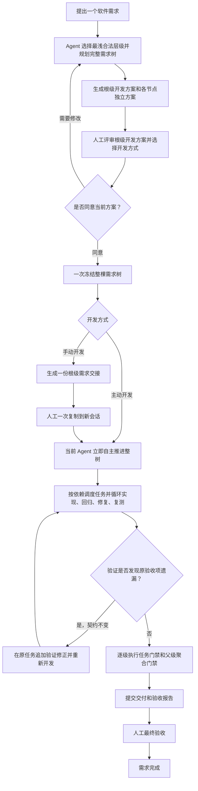

# Hierarchical Delivery Governance

面向 AI Agent 的分层交付治理 Skill。它把一个软件需求整理成可人工评审、一次冻结、自动开发、持续回归和最终验收的交付树。

项目与 Skill 均由 Python 3.10+ 和标准库驱动，不需要 Node、npm、第三方 Python 包或全局 CLI。

## 人工参与边界

人在正常流程中只参与以下环节：

1. 冻结前查看根级 `development-plan.md`，确认需求、开发方案和开发方式；
2. 选择 `active` 或 `manual`。`manual` 只需把根级交接内容复制到新会话一次；
3. 全部开发、回归和门禁完成后，接收交付并进行最终人工验收。

一次确认会冻结整个需求树，不逐 Task 批准，不要求人工知道或复制指纹。冻结后的 Task 调度、Agent 数量、并发或串行策略、失败重试和回归复测由执行 Agent 自主处理。验证发现原验收项的文件遗漏时回到原 Task 追加修正，不创建第二个需求根；只有目标、契约、拓扑或外部权限需要变化时，才重新回到人工评审。

## 完整流程



## 层级结构

每个需求使用满足真实聚合责任的最浅结构：

| 结构 | 适用场景 | 执行责任 |
|---|---|---|
| `Task` | 一个可独立开发和验收的结果 | Task 直接执行 |
| `Capability → Task` | 多个 Task 需要共享契约、依赖或集成验收 | Capability 聚合，Task 执行 |
| `Delivery → Capability → Task` | 多个 Capability 需要跨能力约束或顶层交付验收 | Delivery 和 Capability 聚合，Task 执行 |

Task 是唯一执行叶子。文件数量、接口数量、仓库大小或风险等级不能单独决定创建 Capability 或 Delivery。

每个用户需求只生成一个顶层目录。Capability 和 Task 必须按真实父子关系递归放入 `children/`，不能平铺成多个需求目录。

## 冻结前开发方案

根级 `development-plan.md` 是整棵需求树唯一的人工冻结评审入口。人在开工前可以从中看到：

- 开发目的、业务场景和验收目标；
- 完整的 Delivery、Capability、Task 层级；
- 每个 Task 的精确文件改动；
- 接口、函数、共享契约、数据和事务变化；
- Task 依赖、开发波次和集成关系；
- 测试映射、兼容性和人工评审重点。

每个实际子节点也有自己的 `development-plan.md` 和 `progress.md`，供执行 Agent 获取独立上下文和查看节点进度。需求根的 `progress.md` 专门展示整树总进度，根节点自身状态单独写入 `node-progress.md`；总进度表中的根节点“进度”入口必须指向该独立文件，不能回链整树总进度。根级方案仍负责一次评审整树，不需要人工逐个进入子目录批准。

## 开发方式

### 主动开发

选择 `active` 后，当前 Agent 在整树冻结后立即推进开发。它根据依赖、写入范围和可用能力决定使用多个子 Agent、安全串行或由当前 Agent 逐个开发；运行能力变化时自动降级，不重新询问开发方式。

### 手动开发

选择 `manual` 后，规划会话只生成一份根级 `requirement-handoff.md`。人工把这份交接复制到一个新会话一次，新会话随后负责整个需求树的调度、开发、测试和门禁，不再逐 Task 请求人工交接或启动。

开发方式只决定由当前会话还是新会话接管执行，不锁定 Agent 数量和并发策略。

## 自动开发与验收闭环

执行 Agent 按依赖计算当前可执行 Task，并循环完成：

```text
认领 Task
→ 获取该 Task 的独立上下文
→ 实现
→ 回归测试
→ 修复与复测
→ 写回开发结果
→ 生成 development-review.md
→ 执行 Task 门禁
→ 生成 acceptance-report.md
```

Task 通过后，Capability 和 Delivery 按层级执行自己的聚合门禁。开发中没有额外人工门禁；可恢复失败由 Agent 在原冻结契约内自动重试。开发结果只能写回“已实现”或“已阻断”，不能绕过门禁自行宣布通过。

若回归、门禁、独立审查或最终验收发现：原需求与验收标准没有变化，但冻结方案漏列了完成原验收项所需的精确文件，控制器使用 `remediate-task` 把修正追加到原 Task。原 baseline 和 `development-plan.md` 保持不变，补充文件及原因进入 SQLite 审计链、开发复核和验收报告；Task 与已通过的父级 gate 重新执行。只有需求已经完成或契约确实变化时才建立新需求。

根工作项的 `progress.md` 使用 Markdown 表格展示整树进度，并与 `development-plan.md` 保持相同的节点 ID、父子顺序和层级。每次控制器写回都会从 SQLite 自动重建进度表。

## SQLite 与可读文件

每个项目只有一个：

```text
.hierarchical-delivery-governance/governance.sqlite3
```

它保存项目内全部需求的结构化状态、层级、冻结信息、Task 认领、开发结果、门禁报告和交互摘要。不同需求通过根工作项 ID 隔离，不为每个 `<root-id>` 单独创建数据库。

需求目录只保留供人查看、评审和验收的 Markdown 投影：

```text
.hierarchical-delivery-governance/
├── governance.sqlite3                 # 项目内唯一机器权威
├── workspace-overview.md
└── work-items/
    └── <root-id>/                     # 一个需求只有一个顶层目录
        ├── baseline.md
        ├── development-plan.md        # 整树冻结评审入口
        ├── progress.md                # 整树进度表
        ├── interaction-log.md         # 人机指令、决策和状态摘要
        ├── requirement-handoff.md     # 仅 manual 冻结后生成
        ├── development-review.md      # 开发结果写回后生成
        ├── acceptance-report.md       # 门禁后生成并持续更新
        └── children/
            └── <child-id>/
                ├── baseline.md
                ├── development-plan.md
                ├── progress.md
                └── children/...
```

Markdown 不是机器权威。手工删除 `<root-id>` 目录不会删除 SQLite 中的需求状态，刷新投影后目录还会被重建，因此不能用删除目录代替需求状态清理。

多个需求在同一数据库中按工作项隔离。若某个历史节点只有 evidence 引用不符合当前契约、但完整 artifact 和其余结构仍有效，控制器会把该节点标记为只读隔离并在 `workspace-overview.md` 告警：不迁移、不改写历史记录，同时允许新需求和其他有效 Task 继续。数据库 schema、ID、拓扑、路径或其他结构损坏仍会全局阻断。

## 安装

仓库提供一个 Python 安装器，可同时更新 Codex 和 Claude：

```text
python scripts/install_skill.py --target both --scope user --dry-run
python scripts/install_skill.py --target both --scope user --force
```

也可以只安装一个宿主：

```text
python scripts/install_skill.py --target codex --scope user --force
python scripts/install_skill.py --target claude --scope user --force
```

安装后从当前宿主的 Skill 目录运行控制器：

```text
python -X utf8 <skill-root>/scripts/hdg.py --help
```

开发结果、验证修正、节点门禁和最终验收的完整证据 artifact 必须通过 `--evidence -` 从 stdin 直接交给控制器；证据文件路径会被拒绝。控制器在同一个 SQLite 写事务中校验当前工作项、operationId、baseline 和动作，计算规范 JSON 的 SHA-256，并同时保存完整 artifact 与摘要。因此不会产生 `.hdg-tmp`、系统 `TEMP` 或其他临时 evidence JSON，Agent 也不能直接写 SQLite。

一次性的 definition 和 interaction JSON 也应通过 stdin 传入，避免跨卷路径和无意义的中间文件。

## 主要控制命令

| 命令 | 作用 |
|---|---|
| `prepare-hierarchy` | 准备完整需求树并生成开发方案和进度投影 |
| `freeze-hierarchy` | 使用一次人工确认冻结整棵树并记录开发方式 |
| `ready-tasks` | 计算当前满足依赖和范围条件的 Task |
| `dispatch-task` | 原子认领一个 Task 并建立独立执行上下文 |
| `task-result` | 写回开发结果并生成开发复核 |
| `remediate-task` | 把同一验收契约的验证修正追加到原 Task，并重新进入开发门禁循环 |
| `accept-item` | 执行节点门禁并生成验收报告 |
| `retry-item` | 在当前冻结契约内恢复可重试节点 |
| `refresh-projections` | 从 SQLite 重建 Markdown 投影 |
| `record-interaction` | 记录必要的人机指令、决策或状态摘要 |

具体参数以当前安装版本的 `hdg.py --help` 为准。人工不需要直接拼接层级指纹或逐个执行这些命令，它们由使用 Skill 的 Agent 调用。

## 仓库维护

修改控制器源码后，重新构建 Skill 内置控制器并运行验证：

```text
python scripts/build_skill.py
python -m unittest discover -s tests -t . -v
python -m compileall -q src scripts tests
git diff --check
```

完整规则见 [Skill 入口](skills/hierarchical-delivery-governance/SKILL.md)、[工作流与全中文流程图](skills/hierarchical-delivery-governance/references/workflow.md)、[开发方案字段](skills/hierarchical-delivery-governance/references/development-plan.md)、[同一 Task 的验证修正](skills/hierarchical-delivery-governance/references/validation-remediation.md) 和 [SQLite 工作项注册表](skills/hierarchical-delivery-governance/references/task-registry.md)。
