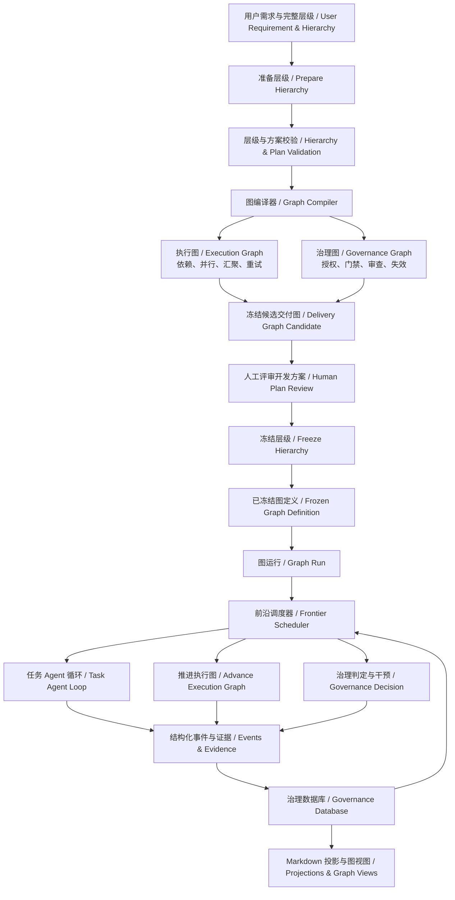
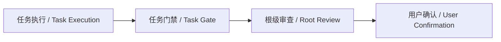
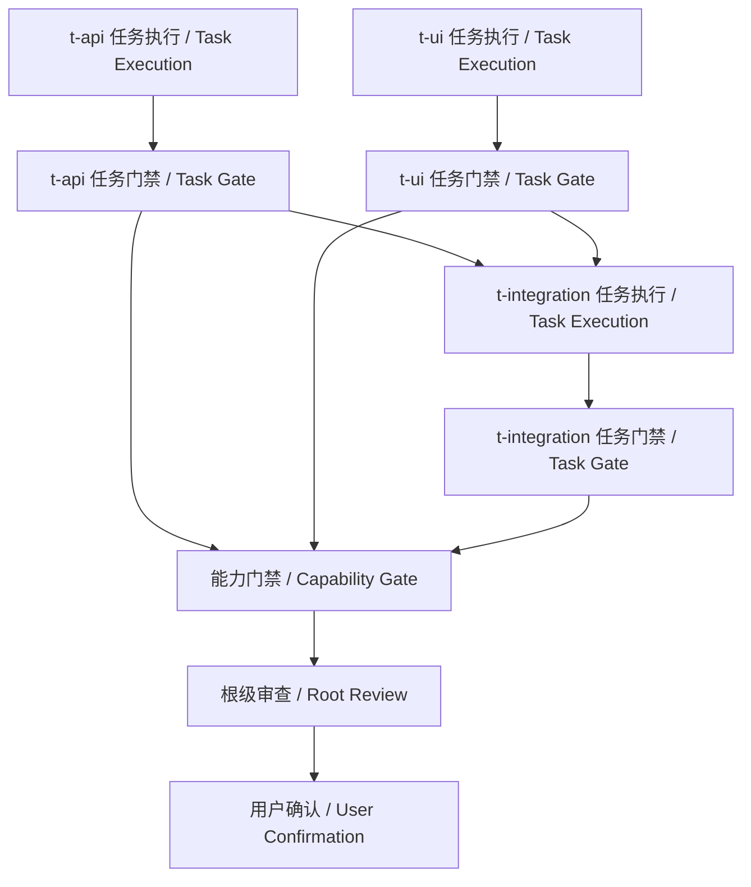

# Layered Delivery Graph Engineering 升级设计与实施说明

> 状态：已确认并完整实施（2026-07-21），包括契约 DAG、运行时 FSM、失败 Router、claim 租约、自动恢复、暂停/取消、关键路径、frontier 看板、图坐标证据绑定与事件回放恢复
>
> 目标版本：继续使用当前完整 schema v3
>
> 项目定位：面向 AI 辅助软件开发的分层交付治理，而不是通用 Agent 工作流框架

## 1. 结论

`layered-delivery` 可以升级为 Graph engineering，并且不需要推翻现有实现。

推荐的目标不是“用 Graph 替换 Loop”，而是：

```text
冻结的交付图 = 执行图 + 治理图
        ↓
可恢复的 Graph Run 与节点状态
        ↓
每个执行节点内部的 Agent Loop
```

升级后：

- Delivery、Capability、Task 仍然是用户理解和评审需求的主要模型；
- 当前“实现 → 测试 → 修复 → 复测”循环继续作为 Task 节点内部执行机制；
- 控制器把层级和依赖编译成执行图，把 baseline、门禁、审查、确认和修正回流编译成治理图；
- SQLite 持久化图定义、图运行、节点尝试和事件；
- 宿主不再只查询 READY Task，而是查询整个执行图的当前 frontier，并按结构化动作推进；
- 冻结依赖保持 DAG，运行时循环由 FSM 和 Router Policy 表达；可重试失败与失联执行在预算内自动恢复，耗尽后机械阻断；
- 用户不需要手写节点和边，也不需要逐 Task 指挥 Agent。

项目名称继续使用 `layered-delivery`。Graph engineering 是内部架构升级，不建议再次更名。

## 2. 当前系统已经具备什么

当前系统不是纯粹的单 Agent Loop，已经包含一部分图能力：

| 能力 | 当前实现 | 当前限制 |
|---|---|---|
| 节点 | Delivery、Capability、Task | 只有固定工作项节点，执行阶段没有显式节点 |
| 层级关系 | Delivery → Capability → Task | 主要作为树形聚合关系 |
| 依赖关系 | Capability 和 Task 的 `dependsOn` | 依赖范围受层级限制，边没有显式类型 |
| 就绪计算 | `ready-tasks` | 只返回 Task ID，不能说明完整 frontier 和阻断原因 |
| 并行 | 无依赖、无路径冲突的 Task 可并行 | 调度循环主要由宿主说明驱动 |
| 汇聚 | 子级全部 VERIFIED 后运行父级 gate | fan-in 逻辑隐含在验收代码中 |
| 状态 | SQLite 唯一机器权威 | 工作项状态同时承载合同和执行含义 |
| 恢复 | claim、operationId、revision、指纹 | 缺少 graph run、node run 和 attempt 视角 |
| 回流 | retry、remediation、祖先 gate 失效 | 回流关系隐含在命令实现中 |
| 可读投影 | plan、progress、review、acceptance report | 没有完整图、frontier、关键阻断和运行时间线 |

因此，本次升级的本质是：把已经存在但分散在 `model.py`、`execution.py`、`acceptance.py`、`remediation.py` 和 Skill 文档中的图语义，收敛成一个可验证、可持久化、可执行的统一模型。

## 3. 升级原则

### 3.1 保留 Layered Delivery 的产品边界

- 用户仍按最浅必要深度选择 Task、Capability → Task 或 Delivery → Capability → Task。
- Task 仍是唯一修改业务文件的执行叶子。
- Capability 和 Delivery 仍负责聚合契约与门禁，不直接开发业务代码。
- 一个需求仍只有一个根目录和一次整树人工冻结。
- Graph 不能成为绕过 baseline、scope、fileChanges、gate 或用户确认的入口。

### 3.2 图由控制器编译，不由用户手写

用户输入仍是完整层级 definition。控制器在 `prepare-hierarchy` 时把它确定性编译为 Graph IR，并同时计算：

- `hierarchyFingerprint`：绑定人工看到的完整交付层级与方案；
- `graphFingerprint`：绑定可执行节点、边、条件和汇聚规则。

两者都必须在 `freeze-hierarchy` 中重新校验。层级或图发生变化后，旧确认失效。

### 3.3 合同图冻结，运行策略可变

冻结后不能自行新增、删除或改写 Task、依赖、门禁和审查节点。运行时可以改变：

- 使用多少 Agent；
- 并行还是串行；
- 哪个可用 Agent 承担某个 READY Task；
- 在允许范围内执行多少次实现、测试、修复循环。

运行策略变化不能改变冻结合同图。

### 3.4 路由必须可解释、可重放

每次节点状态变化必须由结构化事件触发，记录：

- 事件类型；
- 目标节点和关联工作项；
- 当前 graph/node run；
- operationId、attempt 和 actor；
- 前置状态、后置状态；
- 证据引用和时间；
- 当前 graph fingerprint；
- 前序事件哈希。

不能依赖对话记忆推断图为什么走到当前节点。

### 3.5 不引入通用动态图和任意代码路由

第一版不支持：

- Agent 在冻结后自己创建新 Task；
- 任意 Python 表达式作为边条件；
- 用户直接写循环边；
- 把聊天消息当作路由条件；
- 为了“更智能”而自动跳过 gate；
- 自动提交、推送、迁移、发布或改变其他外部状态。

依赖图保持 DAG。retry 和 remediation 是受控状态迁移，不是用户定义的任意环。

## 4. 目标架构



目标架构使用一份冻结的 Delivery Graph definition，但提供执行图和治理图两种有类型的视图。两张图共享稳定 node ID、workItemId、graph fingerprint 和同一事件流，不形成两个状态权威。

### 4.1 Contract Graph：冻结合同定义

合同图回答：

- 有哪些工作项和门禁；
- 谁依赖谁；
- 哪些结果必须汇聚；
- 什么条件可以进入审查；
- 哪些修正会使哪些结果失效。

合同图是人工评审内容的机械表达，属于冻结契约的一部分。

### 4.2 Execution Graph：执行图

执行图回答：

- 哪个 Task 可以开始；
- 哪些 Task 可以并行；
- 哪些输出是后继节点的前置条件；
- Task 完成后进入哪个 gate；
- 多个结果在哪里汇聚；
- retry 后从哪个 execution attempt 重新开始。

执行图主要由 Task execution、Task gate、Capability gate 和 Delivery gate 节点，以及依赖、成功和汇聚边组成。

### 4.3 Governance Graph：治理图

治理图回答：

- 当前节点是否获得冻结授权；
- scope、fileChanges、baseline 和父级合同是否仍有效；
- 哪些 evidence 可以使 gate PASS；
- 哪些节点需要独立审查、人工判断或用户确认；
- retry/remediation 是否仍属于原验收契约；
- remediation 应使哪些已通过结果失效；
- 哪个规则阻断了当前执行流。

治理图不是另一套自由运行的 Agent 工作流，而是覆盖执行图的控制面。它通过门禁、审查、确认、阻断和失效边约束执行图。执行图回答“下一步做什么”，治理图回答“是否允许、是否可信、失败后退回哪里”。

### 4.4 Work Graph：运行时实例

工作图回答：

- 当前运行到哪里；
- 哪些节点 READY；
- 哪些节点正在被哪个 operation 执行；
- 哪些节点等待依赖、范围释放、证据、审查或用户确认；
- 失败后允许重试哪个节点；
- remediation 后哪些节点被失效并需要重新运行。

每次冻结的需求创建一个当前 graph run。每次 retry/remediation 产生新的 node attempt，但继续属于同一未完成需求和同一 graph run；只有合同变化并重新形成新需求时，才创建新的冻结合同图。

### 4.5 Node Loop：节点内部循环

Task 执行节点内部继续使用现有 Loop：

```text
理解冻结上下文
→ 实现
→ 运行相关测试
→ 修复
→ 复测
→ 写回 IMPLEMENTED 或 BLOCKED
```

Graph 负责“谁在什么时候做什么”；Loop 负责“一个执行节点如何把自己的工作做好”。

### 4.6 Prompt、Context、Harness、Loop、Graph 的关系

可以把五层理解成控制范围逐层扩大：

| 层 | 主要问题 |
|---|---|
| Prompt | 一次模型调用说明什么 |
| Context | 这次调用看见什么 |
| Harness | 模型能使用什么工具、状态和安全边界 |
| Loop | 一个执行主体如何持续行动、校验和重试 |
| Graph | 多个执行主体、确定性步骤和治理节点如何协作 |

这不是严格的软件套娃。实际实现中，一张 Graph 包含多个节点，每个 Agent 节点可以拥有独立 Prompt、Context、Harness 和 Loop；普通函数、router、join、gate 和人工确认节点则不一定包含模型调用。外层扩大控制范围，内层能力不会消失。

## 5. Graph IR 设计

Graph IR 只存 SQLite，不生成机器权威 JSON 文件。下面的 JSON 仅用于说明结构。

```json
{
  "schemaVersion": 3,
  "rootId": "c-user-export",
  "hierarchyFingerprint": "sha256:...",
  "graphFingerprint": "sha256:...",
  "nodes": [
    {
      "id": "task:t-export-backend:execute",
      "kind": "TASK_EXECUTION",
      "workItemId": "t-export-backend"
    },
    {
      "id": "task:t-export-backend:gate",
      "kind": "TASK_GATE",
      "workItemId": "t-export-backend"
    },
    {
      "id": "capability:c-user-export:gate",
      "kind": "CAPABILITY_GATE",
      "workItemId": "c-user-export"
    },
    {
      "id": "root:c-user-export:review",
      "kind": "ROOT_REVIEW",
      "workItemId": "c-user-export"
    },
    {
      "id": "root:c-user-export:confirm",
      "kind": "USER_CONFIRMATION",
      "workItemId": "c-user-export"
    }
  ],
  "edges": [
    {
      "id": "edge:t-export-backend:execute-to-gate",
      "from": "task:t-export-backend:execute",
      "to": "task:t-export-backend:gate",
      "kind": "ON_SUCCESS"
    }
  ]
}
```

### 5.1 节点类型

| 节点类型 | 执行者 | READY 条件 | 成功结果 |
|---|---|---|---|
| `TASK_EXECUTION` | 开发 Agent 或当前宿主 | 依赖 gate 已通过、路径无冲突、无 claim | 产生 IMPLEMENTED 结果，激活 Task gate |
| `TASK_GATE` | 验收 Agent/宿主 | Task 已 IMPLEMENTED 且证据完整 | Task VERIFIED |
| `CAPABILITY_GATE` | 验收 Agent/宿主 | 全部直接 Task gate 通过 | Capability VERIFIED |
| `DELIVERY_GATE` | 验收 Agent/宿主 | 全部直接 Capability gate 通过 | Delivery VERIFIED |
| `ROOT_REVIEW` | 独立只读 Agent或人工 | 根 gate 通过 | 进入用户确认 |
| `USER_CONFIRMATION` | 用户 | 根审查通过 | 需求 COMPLETED |

Task、Capability、Delivery 仍是合同工作项；上表是从工作项编译出的执行节点。这样不会为了表示 gate 和审查而虚构空 Capability 或 Delivery。

### 5.2 边类型

| 边类型 | 含义 |
|---|---|
| `ON_SUCCESS` | 来源节点成功后允许目标节点参与 frontier 计算 |
| `REQUIRES_PASS` | 目标节点必须等待指定前置 gate PASS |
| `ALL_OF` | 同一 join 组的所有来源节点成功后，目标节点才 READY |
| `ON_BLOCKED` | 来源节点阻断后，把目标状态保持为等待或阻断，不跳过前置条件 |
| `INVALIDATES` | remediation 发生时，使 Task gate 和祖先 gate/review/confirmation 失效 |
| `RETRY_OF` | 新 node attempt 与上一次失败 attempt 的审计关系 |

`CONTAINS` 属于合同层级关系，不直接决定执行路由；控制器会从 `CONTAINS + dependsOn + gate` 编译出上述执行边。

### 5.3 节点运行状态

建议统一为：

```text
PENDING
READY
CLAIMED
WAITING_EVIDENCE
SUCCEEDED
BLOCKED
INVALIDATED
COMPLETED
```

说明：

- `READY` 是运行图中的持久化派生快照，但每次读取时必须从边、节点和活动 claim 重新验证；
- `CLAIMED` 只适用于需要外部执行的节点；
- `SUCCEEDED` 表示当前节点成功，不等于整个需求完成；
- `INVALIDATED` 表示曾成功，但因同契约 remediation 必须重新运行；
- `COMPLETED` 只用于最终用户确认节点和整个 graph run。

现有工作项状态继续作为面向治理的汇总视图，由 graph node 状态机械投影，避免两个互不一致的状态权威。

## 6. 图编译规则

### 6.1 根 Task



### 6.2 根 Capability

假设 `t-api` 和 `t-ui` 可以并行，而 `t-integration` 依赖二者：



### 6.3 Delivery

- 每个 Task 编译为 execution + gate；
- 每个 Capability 编译为一个 Capability gate；
- Capability `dependsOn` 编译为“提供方 Capability gate → 消费方全部入口 Task”的 `REQUIRES_PASS` 边；
- 所有 Capability gate 以 `ALL_OF` 汇聚到 Delivery gate；
- Delivery gate 通过后进入根审查和用户确认。

### 6.4 remediation 回流

如果 `t-api` 已通过，但最终审查发现同一验收项遗漏一个精确文件：

1. `remediate-task` 校验合同、拓扑和外部授权不变；
2. 原 `t-api` execution/gate 进入 `INVALIDATED`；
3. 依赖其输出的后继节点，以及已通过的 Capability/Delivery gate 和根审查状态失效；
4. 为 `t-api` 创建下一次 attempt；
5. 从新的 frontier 重新推进；
6. 不创建新需求根，不修改原 baseline，不改变 graph definition。

失效传播必须沿显式边计算，不能继续依赖手写父链特例。

## 7. SQLite 数据模型升级

继续使用一个 `.layered-delivery/governance.sqlite3`。建议在当前完整 schema v3 中增加以下表：

### 7.1 `graph_definitions`

保存冻结合同图：

- `root_id`
- `hierarchy_fingerprint`
- `graph_fingerprint`
- `compiler_version`
- `definition_json`
- `created_at`
- `frozen_at`

### 7.2 `graph_nodes`

保存规范化节点：

- `graph_fingerprint`
- `node_id`
- `node_kind`
- `work_item_id`
- `join_policy`
- `config_json`
- `node_fingerprint`

### 7.3 `graph_edges`

保存规范化边：

- `graph_fingerprint`
- `edge_id`
- `source_node_id`
- `target_node_id`
- `edge_kind`
- `join_group`
- `condition_json`
- `edge_fingerprint`

### 7.4 `graph_runs`

保存需求运行状态：

- `run_id`
- `root_id`
- `graph_fingerprint`
- `status`
- `started_at`
- `updated_at`
- `completed_at`
- `record_revision`

### 7.5 `node_runs`

保存节点当前状态与尝试：

- `run_id`
- `node_id`
- `attempt`
- `status`
- `owner`
- `operation_id`
- `claimed_at`
- `heartbeat_at`
- `started_at`
- `finished_at`
- `latest_evidence_hash`
- `record_revision`

`heartbeat_at` 只用于识别失联风险，不能仅因超时就自动重复派遣。无法确认旧 Agent 是否还在写文件时，仍然必须阻断并核对，避免双写。

### 7.6 `graph_events`

保存不可变运行事件：

- `event_id`
- `event_uuid`
- `run_id`
- `node_id`
- `attempt`
- `event_type`
- `actor`
- `operation_id`
- `payload_json`
- `previous_hash`
- `event_hash`
- `recorded_at`

所有状态变更仍使用 `BEGIN IMMEDIATE`，在同一事务内校验 revision、graph fingerprint、node attempt、operationId、证据和事件链，提交后再重建 Markdown 投影。

仓库只维护更新后的完整 schema v3，不增加旧 schema 迁移脚本、双写模式或兼容入口。不满足当前精确 schema 的数据库继续明确阻断。

## 8. Frontier Scheduler

当前 `ready-tasks` 只回答“哪些 Task 可以开始”。升级后的 scheduler 应回答：

- 当前有哪些可执行动作；
- 每个动作为什么 READY；
- 谁在阻断其他节点；
- 哪些动作可以安全并行；
- 当前关键路径和下一次汇聚点是什么。

建议增加：

```text
graph-status --item <root-id>
graph-frontier --item <root-id>
graph-events --item <root-id>
```

`graph-frontier --json` 示例：

```json
{
  "rootId": "c-user-export",
  "runId": "run-c-user-export-001",
  "graphFingerprint": "sha256:...",
  "actions": [
    {
      "nodeId": "task:t-export-backend:execute",
      "action": "DISPATCH_TASK",
      "workItemId": "t-export-backend",
      "parallelGroup": "wave-1",
      "readyBecause": ["dependencies-passed", "scope-available"]
    }
  ],
  "blocked": [
    {
      "nodeId": "task:t-export-ui:execute",
      "blockedBy": ["task:t-export-contract:gate"]
    }
  ]
}
```

Frontier 动作至少包括：

| action | 宿主动作 |
|---|---|
| `DISPATCH_TASK` | 调用 `dispatch-task`，再启动隔离 Agent 或由当前 Agent 执行 |
| `RUN_GATE` | 形成对应层级 gate evidence 并调用 `accept-item` |
| `RETRY_NODE` | 校验当前 baseline/attempt 后调用 `retry-item` |
| `REQUEST_REVIEW` | 启动全新只读审查或准备人工审查包 |
| `REQUEST_USER_CONFIRMATION` | 向用户展示交付并等待明确确认 |
| `BLOCKED` | 展示事实、责任方和解除条件，不自动越过 |

每个现有写命令成功后，在同一事务内调用统一的 `advance_graph()`：

1. 写入事件；
2. 更新当前 node run；
3. 根据边推进后继节点；
4. 重新计算 frontier；
5. 更新工作项汇总状态；
6. 重建投影。

宿主不直接修改 graph/node 状态。

## 9. 升级后的使用方式

### 9.1 用户视角

用户流程基本不变：

1. 提出软件需求；
2. 查看根级 `development-plan.md`，其中新增执行图、并行波次、关键汇聚点和门禁路径；
3. 选择 active/manual 并一次确认冻结；
4. Agent 根据 graph frontier 自动推进；
5. 根 gate 和独立审查完成后，用户最终确认。

用户不需要：

- 手写 Graph JSON；
- 决定每条边；
- 逐 Task 回复“开始”；
- 手动把一个 Agent 的输出搬给另一个 Agent；
- 判断哪个父级 gate 现在可以运行。

### 9.2 准备与冻结

现有命令保持主要语义：

```text
prepare-hierarchy
→ 人工评审 development-plan.md
→ freeze-hierarchy
```

`prepare-hierarchy` 新增返回：

```json
{
  "hierarchyFingerprint": "sha256:...",
  "graphFingerprint": "sha256:...",
  "graphSummary": {
    "nodes": 12,
    "edges": 17,
    "parallelWaves": 3,
    "gateNodes": 5
  }
}
```

`freeze-hierarchy` 同时校验两个 fingerprint，并创建 graph run。

### 9.3 active 模式

执行宿主循环：

```text
graph-frontier
→ 执行本轮 DISPATCH_TASK / RUN_GATE 动作
→ 写回 task-result / accept-item
→ 控制器自动 advance_graph
→ 再次读取 graph-frontier
→ 直到 REQUEST_REVIEW、REQUEST_USER_CONFIRMATION 或真实 BLOCKED
```

宿主有多个隔离 Agent 时，可以执行同一 `parallelGroup` 中范围互斥的 Task；否则自动串行。并发能力变化不改变 graph fingerprint。

### 9.4 manual 模式

用户仍然只复制一次根级 `handoffCommand`。接收会话从 SQLite 恢复 graph run，并按照相同 frontier 循环推进整棵图，不重新准备、不重新冻结、不逐 Task 请求用户启动。

### 9.5 运行中查看状态

```text
python -X utf8 <skill-root>/scripts/hdg.py graph-status --item c-user-export --json
python -X utf8 <skill-root>/scripts/hdg.py graph-frontier --item c-user-export --json
python -X utf8 <skill-root>/scripts/hdg.py graph-events --item c-user-export --json
```

新增人类投影：

```text
.layered-delivery/work-items/<root-id>/
├── execution-graph.md     # 冻结执行图与治理图
├── state-transition-graph.md # 双语开发流程、FSM 与路由策略
├── frontier.md            # 双语关键路径、迁移、预算、允许动作和阻断看板
├── run-timeline.md        # attempt、租约、失败分类与事件时间线
└── progress.md            # 继续保留整树交付进度
```

这些文件仍然全部由 SQLite 重建，不是机器权威。

## 10. 具体代码改动

### 10.1 新增模块

| 文件 | 责任 |
|---|---|
| `src/hdg/graph_model.py` | Graph IR、节点/边校验、图指纹，并把完整 hierarchy 确定性编译成合同图 |
| `src/hdg/graph_runtime.py` | 事件回放、节点状态、关键路径、frontier、图状态和恢复 |
| `src/hdg/graph_projections.py` | `execution-graph.md`、`state-transition-graph.md`、`frontier.md`、`run-timeline.md` 和 Mermaid 图渲染 |

构建 Skill 后，同步生成对应的 `skills/layered-delivery/scripts/hdg/**` 文件。

### 10.2 修改现有模块

| 文件 | 改动 |
|---|---|
| `src/hdg/model.py` | 保留层级 definition 与依赖合法性校验 |
| `src/hdg/planning.py` | prepare 时编译图；freeze 时绑定 graph fingerprint 并创建 run |
| `src/hdg/repository.py` | 增加 graph/evidence 表、精确 schema 校验、图坐标证据绑定、事件链回放和快照重建 |
| `src/hdg/execution.py` | `_task_ready` 改为 graph frontier 的 Task 视图；dispatch/result 驱动 node event |
| `src/hdg/acceptance.py` | Task/Capability/Delivery gate 统一映射到 gate node |
| `src/hdg/remediation.py` | 根据显式边计算失效闭包并创建下一 attempt |
| `src/hdg/cli.py` | 提供 status/frontier/events/replay、advance、heartbeat、pause/resume、cancel 与 rebuild 命令 |
| `README.md` | 从“分层树调度”更新为“分层合同 + 图运行 + 节点循环” |
| `skills/layered-delivery/SKILL.md` | 用 graph frontier 描述 active/manual 自动推进流程 |
| `skills/layered-delivery/references/*.md` | 更新 baseline、执行、并发、事务、恢复、验收和跟踪契约 |

### 10.3 测试改动

已新增并纳入全量回归：

| 测试文件 | 覆盖内容 |
|---|---|
| `tests/test_graph_model.py` | 节点/边精确字段、确定性指纹、未知类型、环路、非法 join、关键路径 fan-in |
| `tests/test_graph_runtime.py` | frontier 看板、并行、fan-in、gate、review、confirmation、bound evidence、事件回放与重建 |
| `tests/test_runtime_fsm.py` | runtime policy、流程图、失败分类、自动重试耗尽、租约失联恢复、暂停/恢复与取消 |
| `tests/test_remediation.py` | Task、依赖消费者和聚合 gate 的失效闭包与下一 attempt |

现有 hierarchy、planning、execution、acceptance、remediation 和安全测试继续保留，用来证明升级没有削弱原治理契约。

## 11. 实施记录：按四阶段渐进升级

升级按确认的四阶段边界完成，每个阶段都保持原测试可通过。

### 阶段一：只读 Graph Compiler（已完成）

交付：

- Graph IR 和严格校验；
- hierarchy → graph 的确定性编译；
- graph fingerprint；
- `execution-graph.md`；
- `graph-status` 只读命令。

此阶段不改变现有 READY、dispatch、gate 和 remediation 行为。目标是先证明“当前语义能够被完整编译成图”。

验收条件：

- 相同 hierarchy 永远生成相同节点、边和 fingerprint；
- 所有现有合法层级都能编译；
- 缺失依赖、循环、错误汇聚和不稳定排序机械失败；
- 图投影可以只从 SQLite 重建；
- 原测试全部通过。

### 阶段二：Graph Run 与 Frontier（已完成）

交付：

- graph_runs、node_runs、graph_events；
- graph frontier 计算；
- `graph-frontier` 和 `graph-events`；
- `ready-tasks` 改为 frontier 的 Task-only 投影；
- dispatch/result 写入 node event。

验收条件：

- 多个独立 Task 正确 fan-out；
- 依赖与路径冲突展示明确阻断原因；
- 进程重启后 frontier 一致；
- 一个 operation 不能重复 claim；
- 写入失败不留下半完成 node event。

### 阶段三：Gate、Review 与 Remediation 图化（已完成）

交付：

- Task/Capability/Delivery gate node；
- 根 review 和 user confirmation node；
- fan-in join；
- retry attempt；
- remediation 失效传播。

验收条件：

- 子级通过不会自动代替父级 gate；
- 根 gate 通过不会自动代替独立审查和用户确认；
- remediation 只失效受影响节点和必要后继；
- 已完成需求不可原地重开；
- graph run 与现有 acceptance report 完全一致。

### 阶段四：宿主协议与可观测性（已完成）

交付：

- 统一 frontier action 协议；
- active/manual handoff 使用同一 graph run；
- 当前 frontier、并行组、关键路径、下一个汇聚点和阻断原因查询；
- 双语 `frontier.md` Markdown 看板；
- evidence artifact 对 `runId/nodeId/attempt/graphFingerprint` 的直接绑定；
- 完整事件回放、快照一致性检查和显式确认重建；
- node attempt 时间线；
- 文档与 Skill 全面切换到 Graph + Loop 表述。

验收条件：

- active 和 manual 只在交接位置不同，后续运行语义一致；
- 宿主不需要从自然语言推断下一条控制器命令；
- 无子 Agent 时自动串行不改变图；
- 任意节点失败后可以从 SQLite 准确恢复下一动作。
- 任意快照偏差都会被回放校验阻断，并可从有效事件链确定性重建。

## 12. 逻辑实施拆分（未创建 dogfood 运行包）

实现工作在逻辑上可映射为一个 Delivery 和三个 Capability：

```text
d-graph-engineering
├── c-graph-contract
│   ├── t-graph-ir
│   └── t-graph-compiler
├── c-graph-runtime
│   ├── t-graph-storage
│   ├── t-frontier-scheduler
│   └── t-transition-and-remediation
└── c-graph-experience
    ├── t-graph-cli
    ├── t-graph-projections
    └── t-skill-docs-and-verification
```

推荐依赖：

```text
c-graph-contract
        ↓
c-graph-runtime
        ↓
c-graph-experience
```

本次属于仓库维护升级，按仓库约束直接修改源码、测试、Skill 与文档，没有创建 `.layered-delivery/**` dogfood 运行包。上图只是工程责任拆分，不是运行态 development plan。

## 13. 升级前后对比

| 场景 | 当前 | 升级后 |
|---|---|---|
| 下一步是什么 | 宿主组合 READY、状态和 Skill 说明判断 | `graph-frontier` 返回结构化动作 |
| 为什么不能执行 | 通常需要检查依赖、claim 和范围 | 节点直接展示 `blockedBy` 和原因 |
| 并行 | READY Task 列表 + 宿主决策 | 显式 parallelGroup + 范围再校验 |
| 父级 gate | 验收模块中的固定判断 | 显式 ALL_OF join 和 gate node |
| 独立审查 | 根 acceptance 状态 | 显式 ROOT_REVIEW 节点 |
| 用户确认 | 单独 acceptance action | 显式 USER_CONFIRMATION 终点 |
| retry | 工作项回到 FROZEN | 新 node attempt，保留失败历史 |
| remediation | 沿父链失效 | 沿图计算精确失效闭包 |
| 恢复 | 工作项状态 + claim | graph run + node attempt + 事件回放 |
| 可观测性 | 树形 progress | 树形治理视图 + 执行图 + frontier + 时间线 |
| Agent Loop | 由 Skill 指导 | 保留，作为 TASK_EXECUTION 内部机制 |

## 14. 主要风险与控制措施

### 风险一：为了 Graph 而过度设计

控制：只支持 Layered Delivery 需要的节点和边，不建设通用 LangGraph 替代品，不引入第三方运行时。

### 风险二：工作项状态与节点状态形成双权威

控制：graph/node run 是执行权威；工作项状态是合同和汇总投影。所有写入由一个事务和一个状态转换函数完成，并机械校验两者一致。

### 风险三：动态拓扑削弱人工冻结

控制：合同图随整树一次冻结；运行时只能创建 attempt，不能创建新合同节点。合同或拓扑变化必须重新评审新的完整需求。

### 风险四：自动重试造成双写

控制：heartbeat 超时只产生风险告警，不自动重新派遣。只有确认旧 claim 已释放，才能创建下一 attempt。

### 风险五：事件和投影导致 SQLite 写事务过重

控制：事务内只写规范状态与事件；Markdown 投影仍在提交后重建。投影失败保持可恢复阻断，不回滚已经成功提交的机器状态事实。

### 风险六：Graph fingerprint 与 hierarchy fingerprint 职责重叠

控制：hierarchy fingerprint 绑定人审合同；graph fingerprint 绑定编译后的执行语义。freeze 同时校验，运行事件只绑定已冻结 graph fingerprint。

## 15. 完成定义

Graph engineering 升级完成必须同时满足：

- 所有合法 Task、Capability、Delivery 层级能确定性编译为图；
- 节点、边、条件、join 和 fingerprint 有严格 schema v3 校验；
- 图冻结与一次人工评审绑定；
- frontier 能完整表达 Task、gate、review 和 confirmation 动作；
- 并行、依赖、范围冲突和 fan-in 行为可机械验证；
- 每个节点支持 attempt、claim、证据、事件和恢复；
- claim 具有租约与心跳，过期执行可确定性归类为 `WORKER_LOST`；
- BLOCKED Task 结果具有结构化 failure class，自动重试严格受 3 次总尝试预算控制；
- 暂停、恢复、尝试耗尽和运行取消是显式 FSM 事件；
- `state-transition-graph.md` 从冻结 runtime 策略生成中文 / English 开发流程与状态图；
- frontier 提供关键路径与双语 Markdown 看板；
- artifact 证据绑定到精确 run、node、attempt 和 graph fingerprint；
- 完整事件回放能重建运行状态并检测或修复快照偏差；
- retry 和 remediation 不修改冻结拓扑；
- remediation 精确失效受影响节点与必要后继；
- SQLite 仍是唯一机器权威，Markdown 可完全重建；
- active/manual 使用同一图运行语义；
- 不自动提交、推送、迁移、发布或扩大文件授权；
- 控制器继续只依赖 Python 3.10+ 标准库；
- 重新构建 bundled Skill；
- 相关测试、全量 `unittest`、Python 编译检查、Skill 校验和 `git diff --check` 全部通过。

## 16. 已确认的三个设计决策

实现采用以下已确认决策：

1. **层级由用户评审、图由控制器编译**，不让用户直接定义任意图；
2. **gate、review、confirmation 是显式图节点**，不只是工作项状态字段；
3. **按四阶段渐进实施**，先构建只读图，再切换运行时权威，避免一次重写全部生命周期。

以上三项均已接受并落实到当前 schema v3 实现。

## 17. 本轮运行时升级的实际差异

### 17.1 开发过程变化

升级前，宿主看到 BLOCKED 后通常自行判断是否调用 `retry-item`；执行者失联也可能长期停留在 CLAIMED。升级后：

1. `dispatch-task` 创建带 30 分钟租约的 claim；
2. 长任务使用 `heartbeat-task` 续租；
3. `task-result: BLOCKED` 必须提交 `failure.class/code/summary`；
4. `RETRYABLE` 在 attempt 1、2 失败时由控制器直接创建下一 attempt；
5. attempt 3 仍失败时写入 `RETRY_EXHAUSTED`，frontier 建议人工干预；
6. `advance-graph` 把过期 claim 归类为 `WORKER_LOST` 并按相同预算恢复；
7. `CONTRACT_CHANGE`、`EXTERNAL_AUTHORITY`、`NON_RETRYABLE`、`REMEDIATION_REQUIRED` 分别路由，不会被笼统重试；
8. `pause-task`、`resume-task` 和经确认的 `cancel-graph-run` 提供显式运行控制。

### 17.2 生成文件变化

- `development-plan.md` 新增 `运行时策略 / Runtime Policy`，评审者在冻结前即可看到最大尝试次数、自动恢复类别和 claim 租约；
- `state-transition-graph.md` 是新增的同源投影，包含 `开发执行流程 / Development Execution Flow`、节点 FSM 和完整迁移表；
- `frontier.md` 新增 transition、route condition、attempt budget、failure class、remaining attempts、last transition 和 recommended action；
- `run-timeline.md` 新增 lease、failure class、last transition 和路由条件；
- `execution-graph.md` 继续只表达冻结执行/治理合同，避免与运行时循环混为一图。

### 17.3 使用方式变化

```text
prepare-hierarchy
→ 评审 development-plan.md + execution-graph.md + state-transition-graph.md
→ freeze-hierarchy
→ graph-frontier / dispatch-task
→ heartbeat-task（长任务）
→ task-result（BLOCKED 时必须分类）
→ advance-graph（周期性处理可机械恢复条件）
→ gate / review / confirmation
```

这仍然是 `layered-delivery` Skill：Skill 提供触发入口和工程规则，Python 控制器执行图语义，SQLite 保存事实，Markdown 面向人类解释整个工程。
