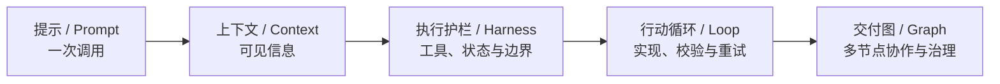
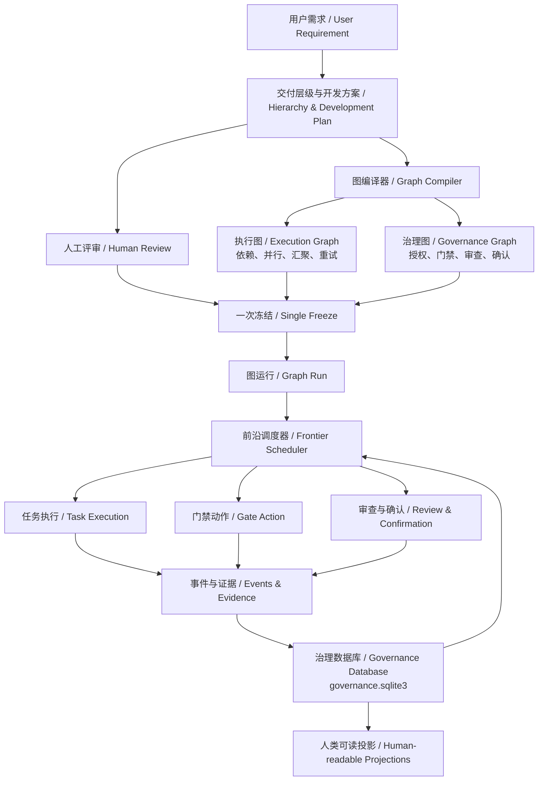
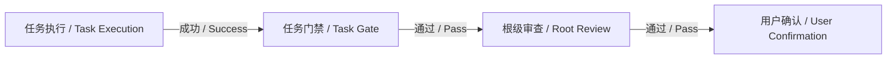
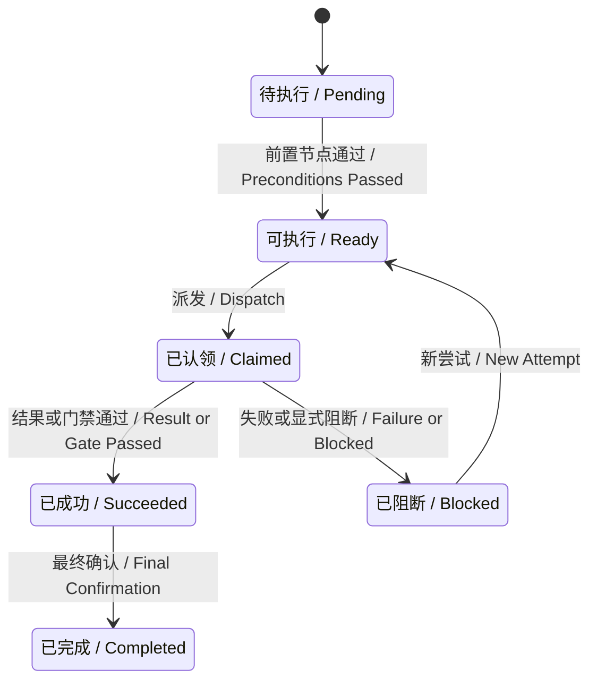

# Layered Delivery：项目工程说明

> 面向项目使用者、技术负责人和贡献者的公开说明。

`layered-delivery` 是一个面向 AI Agent 软件开发的分层交付治理 Skill。它把自然语言需求变成可评审的交付层级，再由 Python 控制器编译成可执行、可恢复、可审计的交付图。

它不是通用工作流平台，也不是让用户手工画图的 Agent 编排器。用户评审的是需求层级和开发方案；控制器负责生成图、计算下一步、验证门禁并记录运行事实。

## 1. 它解决什么问题

AI 可以很快生成代码，但真实交付还需要回答：

- 这次需求到底改什么，不改什么；
- 哪些工作能并行，哪些必须等待依赖；
- Agent 当前获得了哪些文件和外部动作授权；
- 实现结果是否经过测试、门禁和独立审查；
- 中断、失败或修正后应从哪里恢复；
- 最终结果为什么可信，谁确认了完成。

Layered Delivery 把这些问题从对话约定变成可机械验证的工程契约。

## 2. 一句话理解整体架构

```text
用户评审层级与方案
        ↓
控制器编译执行图 + 治理图
        ↓
图前沿驱动 Task、Gate、Review、Confirmation
        ↓
SQLite 保存唯一机器状态，Markdown 提供人类视图
```

核心设计是“双图一体”：

- **执行图 / Execution Graph** 决定下一步做什么；
- **治理图 / Governance Graph** 决定这一步是否被允许、结果是否可信；
- 两者属于同一个冻结的 Delivery Graph，共用节点 ID、图指纹、运行记录和事件链，不形成两套状态权威。

## 3. 从 Prompt 到 Graph

Prompt、Context、Harness、Loop 和 Graph 不是互相替代，而是控制范围逐层扩大。

| 层 | 回答的问题 | 在项目中的作用 |
|---|---|---|
| Prompt | 一次模型调用说明什么 | 描述当前动作和输出契约 |
| Context | 这次调用看见什么 | 提供冻结 Task、父级合同、依赖和验收信息 |
| Harness | 模型能使用什么 | 限制工具、文件范围、状态写入和安全边界 |
| Loop | 一个执行主体如何持续行动 | 在 Task 内实现、测试、修复和复测 |
| Graph | 多个主体和确定性节点如何协作 | 管理依赖、并行、汇聚、门禁、审查和确认 |



一张图可以包含多个 Agent 节点；每个 Agent 节点可以有自己的 Prompt、Context、Harness 和 Loop。门禁、汇聚和用户确认节点则不一定调用模型。

## 4. 分层交付模型

用户只需要选择满足真实责任边界的最浅合法层级。

| 层级 | 何时使用 | 责任 |
|---|---|---|
| `Task` | 一个结果可以独立开发和验收 | 唯一执行叶子，修改业务文件 |
| `Capability → Task` | 多个 Task 需要共享契约、依赖或集成验收 | Capability 聚合 Task 并运行能力门禁 |
| `Delivery → Capability → Task` | 多个 Capability 需要跨能力协调和顶层验收 | Delivery 负责最终交付聚合 |

不支持 `Delivery → Task`、`Capability → Capability` 或任意深度。层级是产品和人工评审模型，不是用户直接编写的图 DSL。

## 5. 目标架构



### 5.1 执行图 / Execution Graph

执行图包含：

- `TASK_EXECUTION`：Task 的实际开发节点；
- `TASK_GATE`：Task 验收门禁；
- `CAPABILITY_GATE`：多个 Task 的能力聚合门禁；
- `DELIVERY_GATE`：多个 Capability 的交付聚合门禁；
- `ON_SUCCESS`、`REQUIRES_PASS`、`ALL_OF` 等有类型的边。

它负责依赖、并行、写入范围冲突、fan-in 汇聚和 retry attempt。

### 5.2 治理图 / Governance Graph

治理图把治理动作提升为显式节点：

- Task、Capability、Delivery gate；
- `ROOT_REVIEW`：根级独立或人工审查；
- `USER_CONFIRMATION`：用户最终确认。

它负责 baseline、scope、精确文件授权、证据、审查、最终确认和 remediation 失效传播。

### 5.3 一个根 Task 如何运行



Task 内部仍然运行原有 Loop：理解冻结上下文 → 实现 → 测试 → 修复 → 复测 → 写回结果。Graph 管理节点之间的协作，Loop 管理单个节点内部的工作质量。

## 6. 图是怎样生成的

用户通过 schema v3 提交完整嵌套层级。`prepare-hierarchy` 完成四件事：

1. 校验层级、合同、依赖、波次、scope 和精确文件计划；
2. 生成可供人评审的 `development-plan.md`；
3. 确定性编译 Delivery Graph；
4. 分别计算层级指纹和图指纹。

`freeze-hierarchy` 用同一次用户确认冻结整棵层级和编译结果。冻结后，运行时可以改变 Agent 数量和串并行策略，但不能新增节点、改写依赖或跳过门禁。

这就是“层级由用户评审，图由控制器编译”。

## 7. 运行时如何推进

控制器不再依赖宿主自己解释一段循环说明，而是计算当前 graph frontier。

`graph-frontier` 可能返回以下结构化动作：

| 动作 | 含义 |
|---|---|
| `DISPATCH_TASK` | Task 依赖满足、文件范围可用，可以派发 |
| `RUN_GATE` | 当前工作项已满足门禁前置条件 |
| `REQUEST_REVIEW` | 根门禁已通过，等待独立或人工审查 |
| `REQUEST_USER_CONFIRMATION` | 审查已通过，等待用户最终确认 |

`ready-tasks` 仍然保留，但它现在是 graph frontier 中 `DISPATCH_TASK` 动作的兼容投影，不再是另一套调度算法。



## 8. 重试、修正和失效传播

图定义是冻结合同，attempt 是运行事实。

- `retry-item` 不修改图，而是为失败节点创建新的 attempt；
- `remediate-task` 只允许在原目标和验收合同不变时，为原 Task 追加遗漏的精确文件；
- remediation 从被修正 Task 的 execution 节点沿显式边计算下游闭包；
- 已完成的依赖消费者、聚合 gate、根审查和确认会失效并重新运行；
- 若失效范围内存在活动 claim，控制器拒绝传播，避免并发双写；
- 已 `COMPLETED` 的需求不可原地修正，后续变化必须形成新需求。

因此，修正不会创建重复需求根，也不会偷偷改变已冻结拓扑。

## 9. 状态、证据与审计

每个冻结需求拥有一个 graph run。每个节点拥有 attempt、状态、owner、operationId、时间和证据摘要。

关键变化会写入不可变图事件链，例如：

- `GRAPH_RUN_STARTED`
- `TASK_CLAIMED`
- `TASK_IMPLEMENTED` / `TASK_BLOCKED`
- `GATE_PASSED` / `GATE_FAILED`
- `REVIEW_PASSED`
- `USER_CONFIRMED`
- `NODE_RETRY_SCHEDULED`
- `GRAPH_INVALIDATED`

每条事件保存前序哈希，读取时重新校验事件链。系统不依赖聊天记忆解释“为什么运行到这里”。

## 10. SQLite 与可读文件

唯一机器权威是：

```text
.layered-delivery/governance.sqlite3
```

schema v3 在原有 workspace、work item、hierarchy、context、report 和 interaction 数据之外，增加：

| 表 | 保存内容 |
|---|---|
| `graph_definitions` | 每个需求根的编译图和指纹 |
| `graph_nodes` | 稳定节点、类型、平面和工作项映射 |
| `graph_edges` | 有类型的依赖、成功和汇聚边 |
| `graph_runs` | 当前冻结图的运行状态 |
| `node_runs` | 节点 attempt、认领、结果和证据摘要 |
| `graph_events` | 带前序哈希的运行事件链 |

Markdown 只是可重建的人类投影：

```text
.layered-delivery/
├── governance.sqlite3
├── workspace-overview.md
└── work-items/
    └── <root-id>/
        ├── development-plan.md
        ├── execution-graph.md
        ├── run-timeline.md
        ├── progress.md
        ├── development-review.md
        ├── acceptance-report.md
        ├── interaction-log.md
        └── children/...
```

- `execution-graph.md` 同时展示中文 / English 的执行图和治理图；
- `run-timeline.md` 展示当前节点 attempt、状态、owner 和事件；
- 删除 Markdown 不会删除机器状态，`refresh-projections` 可以从 SQLite 重建。

## 11. 怎么使用

### 11.1 新需求

```text
prepare-hierarchy
→ 评审 development-plan.md 与 execution-graph.md
→ 选择 active 或 manual
→ freeze-hierarchy
→ graph-frontier / dispatch-task
→ task-result
→ accept-item
→ acceptance-item
→ USER_CONFIRMED / COMPLETED
```

### 11.2 查看当前图

```text
python -X utf8 <skill-root>/scripts/hdg.py graph-status --item <root-or-subtree-id> --json
python -X utf8 <skill-root>/scripts/hdg.py graph-frontier --item <root-or-subtree-id> --json
python -X utf8 <skill-root>/scripts/hdg.py graph-events --item <root-or-subtree-id> --json
```

- `graph-status`：查看全部节点、边、attempt 和运行状态；
- `graph-frontier`：查看当前允许的动作及阻断原因；
- `graph-events`：查看可校验的运行事件链。

### 11.3 恢复中断工作

从 SQLite 读取当前需求，查询 `graph-frontier`，继续返回的结构化动作。不要重新准备、重新冻结，也不要通过 Markdown 猜测状态。

## 12. active 与 manual

两种开发方式使用同一个冻结图和运行时：

- `active`：当前会话成为执行宿主，持续读取 frontier 并推进；
- `manual`：规划会话只生成需求级 handoff，新会话恢复同一个 graph run。

差异只是由哪个会话承担执行，不是两套流程。

## 13. 安全边界

- Task 只能修改冻结 `fileChanges` 和控制器验证通过的 remediation 补充文件；
- scope 是边界，不是任意写授权；
- Agent 不直接写治理数据库或 Markdown 投影；
- gate、review 和 confirmation 不能被自动跳过；
- 系统不自动提交、推送、合并、迁移、发布或改变其他外部状态；
- 当前只维护完整 schema v3，不提供旧 schema 迁移入口；
- 控制器运行时只依赖 Python 3.10+ 标准库。

## 14. 项目代码结构

```text
src/hdg/
├── model.py                 # 分层 definition 与合同校验
├── graph_model.py           # 图编译、图校验与图指纹
├── graph_runtime.py         # 节点状态、frontier 与图查询
├── graph_projections.py     # 双语图和运行时间线
├── repository.py            # SQLite 事务、运行记录和事件链
├── planning.py              # prepare、freeze 与 retry
├── execution.py             # Task 派发、上下文和结果写回
├── acceptance.py            # gate、review 与 confirmation
├── remediation.py           # 同合同修正与图失效传播
└── cli.py                   # Python CLI
```

`scripts/build_skill.py` 会把 `src/hdg` 重建到 `skills/layered-delivery/scripts/hdg`，保证安装后的 Skill 自包含。

## 15. 项目边界

Layered Delivery 有意不做以下事情：

- 不让用户编写任意图或循环边；
- 不在冻结后让 Agent 动态创造新 Task；
- 不使用自然语言表达式作为路由条件；
- 不把聊天记录当作机器状态；
- 不替代 Git、CI、部署平台或组织审批系统；
- 不为追求通用性牺牲可解释性和可恢复性。

项目保留 Layered Delivery 的清晰产品模型，用 Graph Engineering 强化内部控制面。

## 16. 延伸阅读

- [Graph Engineering 升级设计](graph-engineering-upgrade.md)
- [项目 README](../README.md)
- [Layered Delivery Skill](../skills/layered-delivery/SKILL.md)
