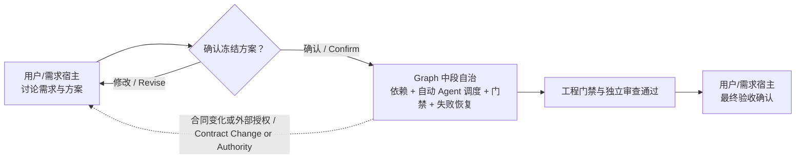
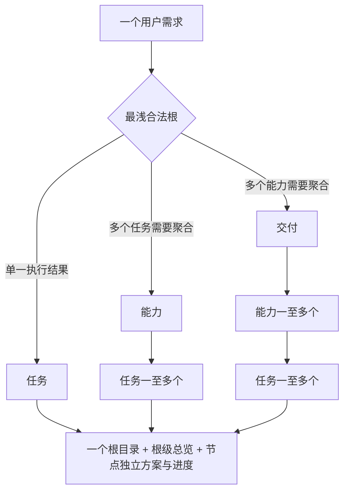
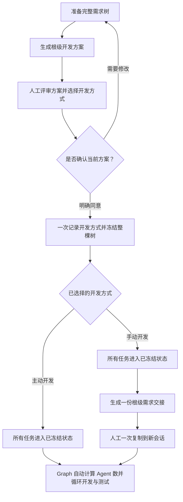
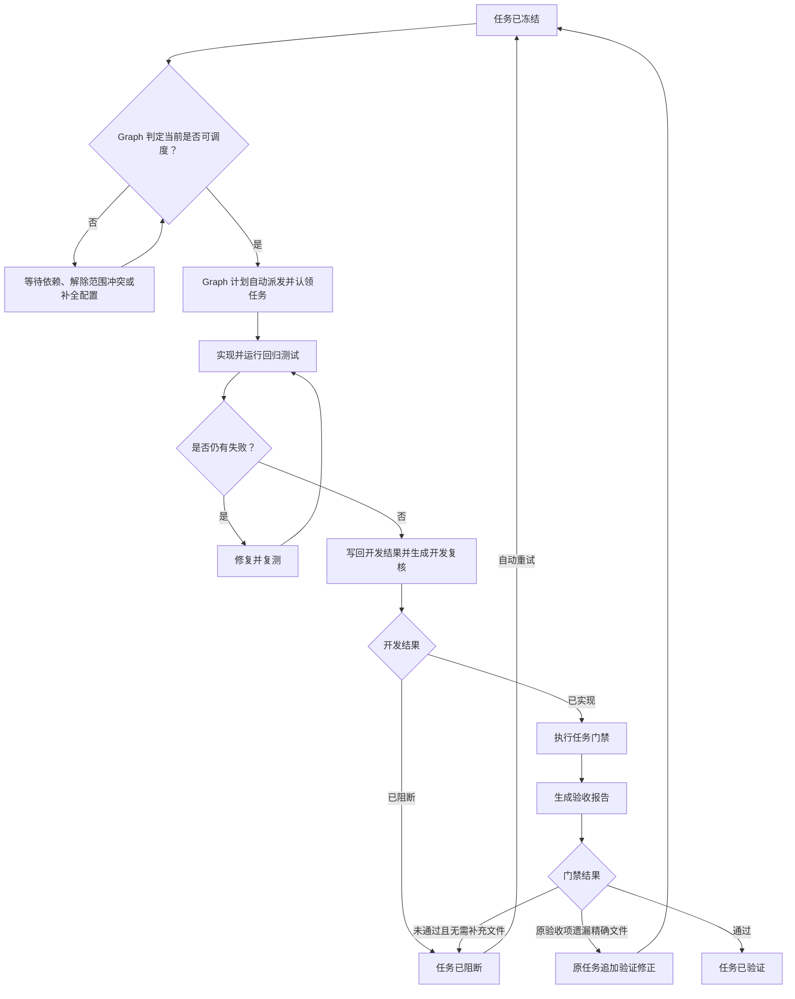
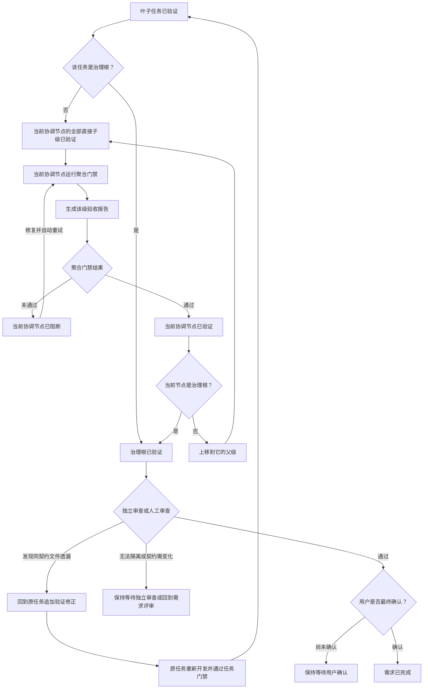

# 分层交付工作流

## 主流程

1. 从当前 Skill 元数据解析 `<skill-root>`（当前已加载 `SKILL.md` 所在目录），再运行 `python -X utf8 <skill-root>/scripts/hdg.py --help`。不得根据用户名、用户主目录、Skill 宿主或操作系统猜测安装位置，也不得把解析后的本机绝对路径固化到交接、方案或治理状态。Python 3.10+ 是唯一运行时，不要求 Node、npm 或第三方包。
2. 只读恢复项目级 `governance.sqlite3`。数据库 schema、ID、拓扑、路径、指纹或普通字段不一致时保持阻断，不迁移、不猜测。仅当历史节点只有 evidence 引用过期、完整 artifact 仍在 SQLite 且其余契约有效时，将该节点只读隔离并在总览告警；其他新需求、有效兄弟 Task 和已有 claim 继续。Markdown 缺失时可从数据库刷新。
3. 起草层级事实卡，选择最浅合法形态：独立 Task、Capability→Task 或 Delivery→Capability→Task。为每个实际节点起草自己的 baseline 与 `developmentPlan`。
4. 把整棵需求树组织成 `{"schemaVersion":3,"root":{"definition":{...},"children":[...]}}`。协调节点声明的每个 child 必须在这棵树里完整物化。
5. 运行 `prepare-hierarchy`。一个需求只生成 `work-items/<root-id>/` 一个顶层目录，子节点按 `children/<id>/` 递归嵌套；根级 `development-plan.md/progress.md` 聚合完整树，控制器同时编译需求级 `execution-graph.md` 与 `frontier.md`，并在 `.layered-delivery/state-transition-graph.md` 维护当前 schema v3 共享的运行时状态投影。根节点自身进度写入 `node-progress.md`，每个实际子节点生成自己的 `development-plan.md/progress.md`。
6. 人工查看根级 `development-plan.md`、`execution-graph.md` 与工作区级 `state-transition-graph.md`，同时选择 active/manual。Agent 必须消费准备结果的 `responseContract`，每次首次准备、方案修订或幂等重试后的确认提示都同时展示两种方式。需要修改就重新准备整棵树；同意时只需确认当前方案和所选方式，无需知道或复述层级/图指纹。
7. Agent 使用准备结果中的 `hierarchyFingerprint`，调用一次 `freeze-hierarchy --expected-hierarchy ... --development-mode ... --confirmed`。控制器在同一事务中记录方式并冻结全部节点；指纹已变化则拒绝旧确认。
8. active 下由当前 Agent 冻结后查询 `graph-frontier` 并直接推进；manual 在需求根生成完整 `requirement-handoff.md`，并返回简短 `handoffCommand`。规划会话必须按冻结结果的 `responseContract` 在首次最终回复中提供可一次复制到其他 Agent 的纯文本代码块；可以使用 `handoffCommand`，也可以生成覆盖 `requiredSemantics` 的语义等价文本，不要求逐字一致，且不能只给文件链接。接收 Agent 即成为同一 graph run 的执行入口。恢复入口是 `graph-frontier` 而不是只读诊断用的 `task-context`；需要 evidence 的动作按紧凑 `evidenceContractRef` 调用 `evidence-contract`，从 SQLite 只读取当前工作项的一个模板，不扫描源码/memory，也不把整树模板放进上下文。查询 JSON 直接消费 stdout，非零退出时保留 stderr 并停止解析，不创建临时 JSON。两种方式都严格消费 Graph 自动计算的 `dispatchPlan`：控制器决定完整安全 Task 集合、目标 Agent 数和稳定顺序，平台容量只决定立即启动或排队，不能挑选子集；不再次询问开发方式或要求人工逐 Task 启动。
9. 开发结果的完整 artifact 通过 `task-result --evidence -` 从 stdin 交给控制器。控制器在同一 SQLite 写事务内校验当前 operationId、计算摘要并保存 artifact 与摘要，然后生成 `development-review.md`；开发结果不代表 PASS，也不产生临时 evidence 文件。
10. 回归、门禁、独立审查或最终验收发现遗漏时，先判断是否仍为原冻结目标和验收契约。已有授权文件内直接重试；仅缺少完成原验收项所需的精确文件，且目标、需求、验收、接口行为、数据、拓扑和外部权限不变时，通过 `remediate-task --evidence -` 追加到原 Task。控制器保持 baseline 与图定义不变，从该 Task execution 沿显式边失效必要后继、依赖消费者和聚合 gate，再创建新 attempt；不得 `prepare-hierarchy` 新建重复需求根。
11. 全部相关回归和复测通过后，Graph 执行循环形成严格 gate artifact，并通过 `accept-item --evidence -` 从 stdin 直接提交。控制器在同一事务中按当前 baseline 和追加验证修正校验、计算摘要并保存结构化验收记录，随后生成 `acceptance-report.md`；Task 全部 VERIFIED 后依次运行 Capability、Delivery 自身聚合门禁。
12. 治理根 gate PASS 后向用户提交交付，由用户人工验收并确认；验收报告持续更新至 `COMPLETED`。

任何步骤都不能从“优化、开发、项目、治理”等自然语言关键词推导创建或冻结授权。

## 人与 Graph 的职责总流程



执行平台只承载 Agent 与队列，不拥有中段任务选择、Agent 数量、调度顺序或失败路由决策权。

## 层级与目录



```text
.layered-delivery/
├── governance.sqlite3
├── workspace-overview.md
├── state-transition-graph.md # 工作区共享的开发流程、FSM 与失败路由
├── assets/
│   ├── development-flow.svg
│   └── node-state-machine.svg
├── workspace-overview/
│   ├── YYYY-MM.md  # 月度需求索引
│   └── YYYY-MM/
│       └── <root-id>.md  # 可直接打开的单需求层级明细
└── work-items/
    └── <root-id>/
        ├── development-plan.md
        ├── execution-graph.md  # 嵌入 SVG 的执行图 + 治理图
        ├── assets/
        │   ├── execution-graph.svg
        │   └── governance-graph.svg
        ├── frontier.md         # 关键路径、动作与阻断看板
        ├── run-timeline.md     # graph run、attempt 与事件
        ├── progress.md         # 整树总进度
        ├── node-progress.md    # 根节点自身进度
        ├── interaction-log.md
        ├── requirement-handoff.md  # 仅 manual 冻结后生成
        ├── baseline.md
        └── children/
            └── <child-id>/
                ├── baseline.md
                ├── development-plan.md
                ├── progress.md
                └── children/...
```

不允许 `Delivery → Task`、`Capability → Capability`、平铺子包或只声明不物化的 child。

## 生命周期

生命周期按职责拆成三段阅读，不把整条状态机挤进一张横向图。

### 1. 整树准备与冻结



人工在同一次前期评审中确认当前根级计划和开发方式；层级指纹由 Agent 和控制器绑定，无需人工复述。manual 的“一次交接”不表示一次认领全部 Task：接收会话读取 Graph 自动生成的完整调度计划，但不再让人逐个转交。目标 Agent 数、并行组、调度顺序和降级路径由 Graph 在每次迁移后计算，不进入冻结方案；执行平台只负责立即启动或排队。

### 2. 单个任务的开发与门禁



“可调度”是实时计算结果，不写入持久化生命周期。“已实现”只表示开发结果已回收，必须继续执行门禁。同契约修正必须使用原 Task 的 `remediate-task`，不能创建新根。实际机械命令依次为 `dispatch-task`、`task-result`、`remediate-task`（仅验证修正需要）、`accept-item` 和 `retry-item`。

### 3. 父级聚合与最终完成



能力和交付都必须在全部直接子级已验证后运行自己的聚合门禁，不能把子级完成等同于父级通过。同契约验证修正必须回到原 Task，并沿显式图边失效必要后继、依赖消费者和聚合 gate。Task 门禁失败时，`retry-item` 在剩余 gate attempt 预算内同时重开 Task execution 与 Task gate，frontier 必须先回到 `DISPATCH_TASK`，不得在 Task 为 FROZEN 时反复给出 `RUN_GATE`；协调节点门禁失败只重开当前聚合 gate。第三次仍失败时转人工干预。两者都不进入最终确认，也不新建重复需求根。

## 恢复与失败关闭

Graph 执行循环应在长任务中调用 `heartbeat-task`，并周期性调用 `advance-graph`。控制器只对结构化 `RETRYABLE` 与租约过期产生的 `WORKER_LOST` 做预算内自动重试；第三次失败后写入 `RETRY_EXHAUSTED`。暂停和恢复使用显式命令及事件；取消整个运行必须由用户明确确认。

- 恢复优先使用用户给出的精确 ID/路径、有效焦点或唯一候选；多个候选时请求选择。
- 只读隔离项不能作为命令目标，也不能被事务修改或删除；它不阻断其他有效工作项。隔离集合在写事务中发生变化时必须回滚。
- 冻结前 `development-plan.md` 被篡改，或 SQLite 中任一 hierarchy/baseline/state 记录不一致时拒绝冻结或调度。
- 人工未在冻结确认中明确选择开发方式时拒绝冻结，不生成可执行上下文。
- 父链漂移、依赖未验证或范围冲突时 Task 不 READY。
- 测试或证据不足时 gate 不 PASS。
- 没有独立审查能力时根保持等待人工审查。
- 未取得用户确认时不得标记 `COMPLETED`。
- 未完成需求的验证发现若映射到已有验收项，不得另建根 Task；使用 `retry-item` 或 `remediate-task` 回到原 Task。已 `COMPLETED` 的需求保持不可变。
