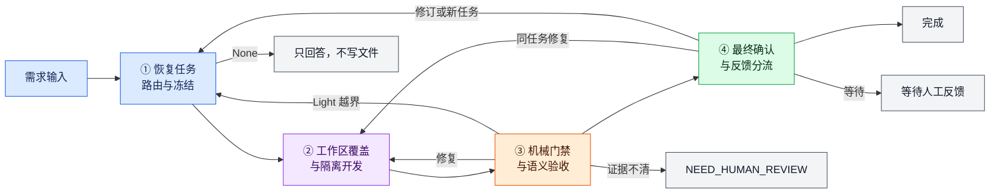
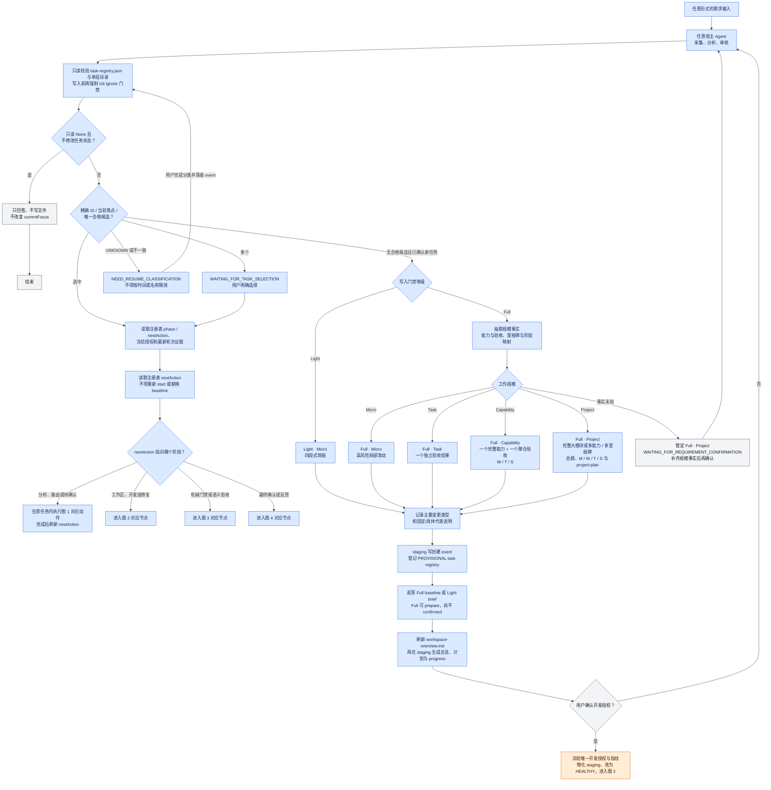
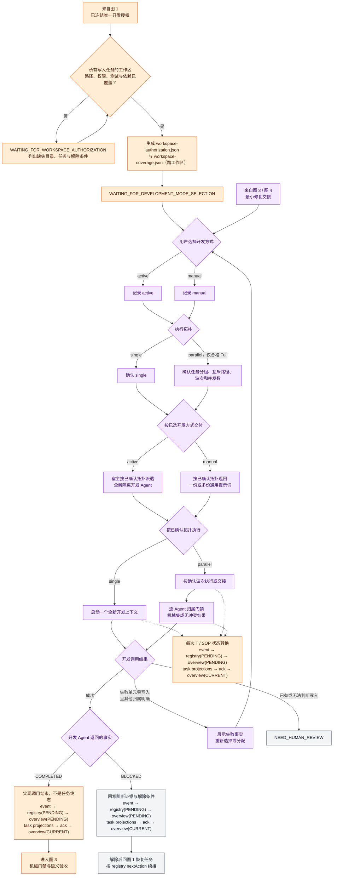
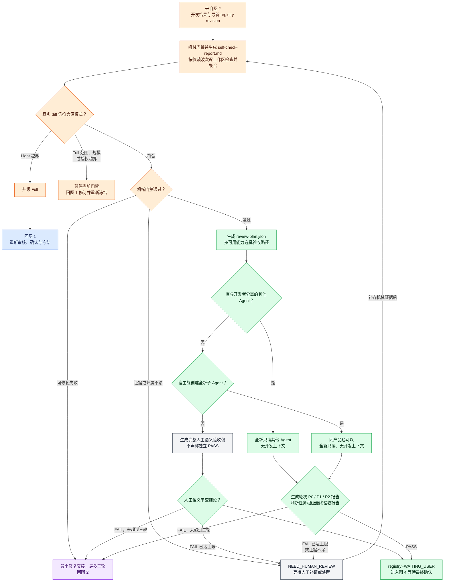
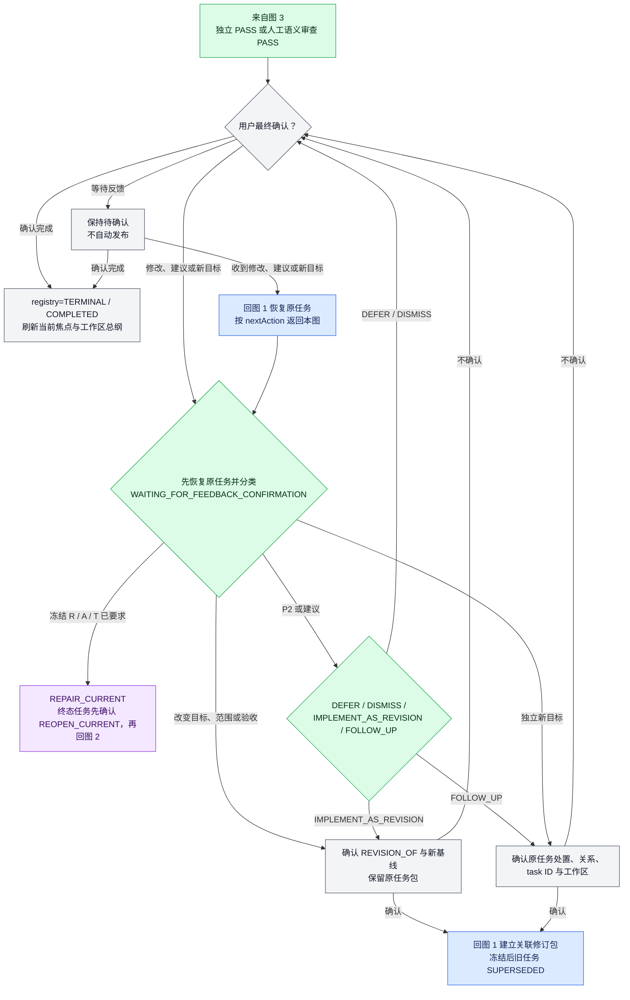

# 工作流程图

本页先给出端到端总览，再按阶段拆成四张子图。跨图连接使用“来自图 N”或“进入图 N”表示，不新增业务状态。

## 目录

- [总览](#总览)
- [图 1：任务恢复、路由与授权冻结](#图-1任务恢复路由与授权冻结)
- [图 2：工作区覆盖与隔离开发](#图-2工作区覆盖与隔离开发)
- [图 3：机械门禁与语义验收](#图-3机械门禁与语义验收)
- [图 4：最终确认与反馈分流](#图-4最终确认与反馈分流)
- [阅读重点](#阅读重点)

## 总览

任务恢复后的 `nextAction` 来自根级 `task-registry.json`，可以直接进入任一对应阶段，不要求从图 1 重新开始。

## 图 1：任务恢复、路由与授权冻结

## 图 2：工作区覆盖与隔离开发

## 图 3：机械门禁与语义验收

## 图 4：最终确认与反馈分流

## 阅读重点

### 入口、恢复与规划

- 根级 `task-registry.json` 保存完整索引、生命周期、当前焦点、周期与完成计数，`workspace-overview.md` 是人可读总纲；冻结包和轮次证据仍放在 `.ai-dev-loop/<task-id>/`。
- 每次开发类消息按精确 ID / 路径、有效当前焦点、唯一 `ACTIVE/WAITING_USER` 候选恢复；多个候选让用户选择，`BLOCKED/DEFERRED/TERMINAL/UNKNOWN` 不参与自动唯一选择。
- 恢复任务后按注册表 `phase` 和 `nextAction` 进入对应阶段，不得按目录时间或名称选择，也不得重新 `start` 或替换冻结 baseline。
- 路由分别记录门禁等级、Micro / Task / Capability / Project 工作规模和主要变更类型；CLI 仍只使用 None / Light / Full，执行拓扑另行选择。
- Full 工作规模判定前先形成可读的规模事实记录，至少列出完整交付边界、独立能力及其聚合验收、用户可验收里程碑或阶段，以及工作流和依赖到这些边界的映射。
- 接口、文件或服务数量，以及公共契约、状态机、幂等、多工作区等 Full 风险信号，都不能单独推出 Project；它们只决定门禁强度或触发规模复核。
- 一个完整能力和一个聚合验收使用 Capability，并按 W/T/S 跟踪工作流、任务与 SOP；完整大模块或多个能力、多个用户可验收里程碑使用 Project，并提供开发总纲、project-plan 和 M/W/T/S 看板。
- 规模事实未知时保守暂定 Project，保持 `WAITING_FOR_REQUIREMENT_CONFIRMATION` 并展示缺失事实；补齐并确认前不得冻结。
- 总览和进度必须显示规模的固定中文代表说明、当前任务的具体说明和上述判定事实。

### 工作区与开发执行

- AI 分析发现跨目录、跨仓库或跨微服务时，只在一个协调工作区保存任务包；必须先证明全部写入任务的工作区、路径、测试目录和依赖已覆盖，才允许生成交接提示词。
- 需求确认、跨工作区覆盖与开发方式选择是独立门禁；冻结后先补齐工作区，再由用户明确选择 active 或 manual。
- active 表示由宿主自动派遣全新隔离开发 Agent，不要求与宿主同类。
- manual 是正式路径，只返回任意 Agent 可接收的通用后续提示词，不预选工具或输出专属 CLI 命令。
- 两种方式都使用同一 `development-handoff.md` 和轮次提示词；开发结束后任意新宿主可读取 `gate-continuation.md` 接管机械门禁，不绑定原对话。
- single / parallel 是独立执行拓扑；只有任务和写入范围可证明互斥的 Full 才能选择 parallel。
- 用户确认 active + parallel 计划后自动派遣，不再逐 Agent 询问；计划变化必须重新确认。
- parallel 先逐 Agent 检查归属并集成，再对最终聚合 diff 运行完整门禁和能力驱动的语义验收。
- 每个执行任务和 SOP 步骤开始、完成、阻断或跳过后必须立即按“不可变 event → registry(PENDING) → workspace-overview(PENDING) → task projections → projection ack → workspace-overview(CURRENT)”回写，再进入下一步；不能在整轮结束后批量补写。

### 机械门禁与语义验收

- `workspace-overview.md` 提供工作区级任务地图，任务内 `development-overview.md` 和 `progress.md` 展示单任务详情；人工验收再优先查看任务根级 `final-acceptance-report.md`。
- 机械门禁生成 `self-check-report.md`；验收先生成 `review-plan.json`，再生成轮次级 `acceptance-report.md` 和 `review.json`，并刷新任务根级 `final-acceptance-report.md`；P0 / P1 阻断、P2 非阻断但必须展示。
- 验收优先使用与开发者分离的其他 Agent；没有其他产品时允许启动同一宿主的全新验收子 Agent，两者都不能继承分析或开发上下文。
- 没有任何隔离 Agent 或子 Agent 时仍完成开发和机械门禁，并生成完整人工验收包；该路径不得声称独立语义验收 PASS。
- 主动调用失败且确认零写入时重新请求选择并推荐 manual；不得自动切换。
- active 与 manual 共用相同冻结授权、机械门禁和验收能力路由。

### 最终确认与后续反馈

- `PASS` 只把生命周期置为等待用户；最终确认后才能写 `TERMINAL / COMPLETED`，且不得自动发布。
- 最终确认阶段的修改、建议或新目标必须先恢复原任务并分类。
- 只有冻结 R / A / T 已要求的缺口才能直接进入同任务修复轮次；机械门禁失败、验收 FAIL 未超三轮和同任务缺口修复都回到图 2。
- 授权变化必须保留原任务包并重新冻结；P2 和新任务都需要单独确认。
- 流程保留四类可见结果：只回答后结束、完成、等待人工反馈、`NEED_HUMAN_REVIEW`。
