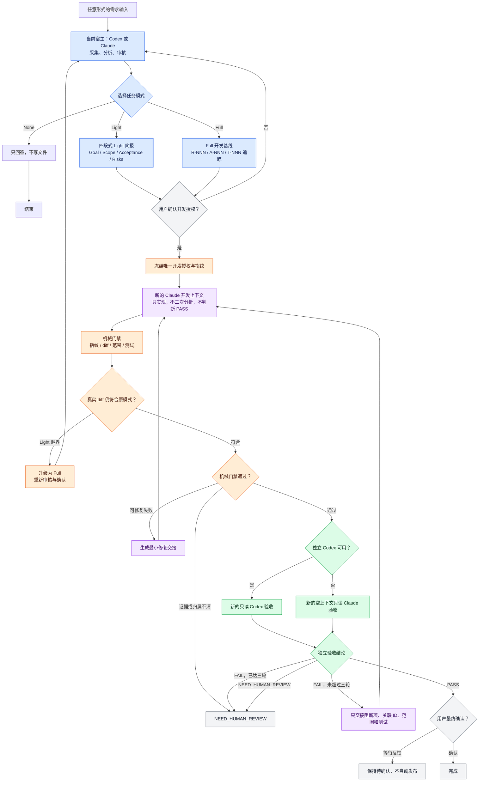

# 工作流程图

## 阅读重点

- 前期需求来源不限，但写代码前必须归一化并由用户确认。
- 当前 Codex 或 Claude 均可审核并冻结；开发前不强制第二个模型复审。
- Claude 开发上下文只执行冻结任务，不做二次需求分析，也不验收自己。
- 机械门禁先于语义验收；真实 diff 越界时必须重新路由。
- 独立验收优先使用新的只读 Codex；不可用时使用新的空上下文只读 Claude。
- `PASS` 只代表独立审查通过，最终完成仍由用户确认。
