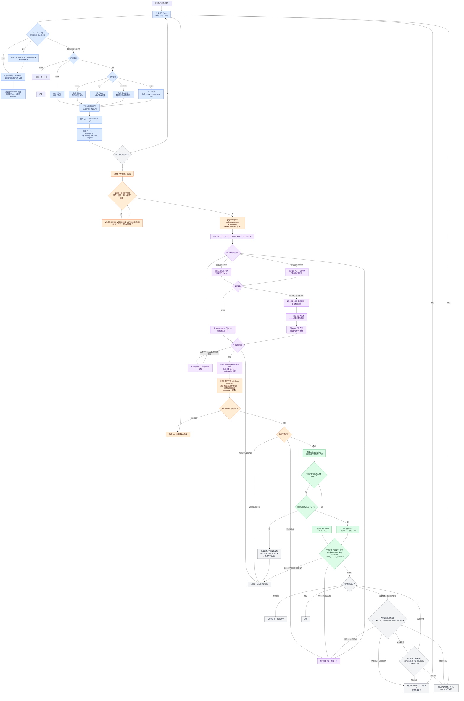

# 工作流程图

## 阅读重点

- 所有产物统一放在 `.ai-dev-loop/<task-id>/`，CLI 缺失也不改变目录。
- 每次开发类消息先恢复已有非终态任务；一个任务直接续接，多个任务让用户选择，没有候选或用户明确批准新任务后才重新路由。
- 路由分别记录门禁等级、Micro/Task/Capability/Project 工作规模和主要变更类型；CLI 仍只使用 None/Light/Full，执行拓扑另行选择。
- 总览和进度必须显示规模的固定中文代表说明及当前任务的具体说明；Capability 展示工作流、依赖和集成门禁，Project 提供开发总纲、project-plan、M/W/T 拆解和 SOP 进度看板。
- AI 分析发现跨目录、跨仓库或跨微服务时，只在一个协调工作区保存任务包；必须先证明全部写入任务的工作区、路径、测试目录和依赖已覆盖，才允许生成交接提示词。
- `development-overview.md` 提供稳定任务地图，`progress.md` 在每次状态转换后更新；独立验收后人工优先查看根级 `final-acceptance-report.md`，再按需追溯这两个视图和轮次证据。
- 需求确认、跨工作区覆盖与开发方式选择是独立门禁；冻结后先补齐工作区，再由用户明确选择 active 或 manual。
- active 表示由宿主自动派遣全新隔离开发 Agent，不要求与宿主同类。
- manual 是正式路径，只返回任意 Agent 可接收的通用后续提示词，不预选工具或输出专属 CLI 命令。
- 两种方式都使用同一 `development-handoff.md` 和轮次提示词；开发 Agent 不需要前期对话。开发结束后任意新宿主可读取 `gate-continuation.md` 接管机械门禁，不绑定原对话。
- single/parallel 是独立执行拓扑；只有任务和写入范围可证明互斥的 Full 才能选择 parallel。
- 用户确认 active + parallel 计划后自动派遣，不再逐 Agent 询问；计划变化必须重新确认。
- parallel 先逐 Agent 检查归属并集成，再对最终聚合 diff 运行完整门禁和能力驱动的语义验收。
- 机械门禁生成 self-check-report.md；验收先生成 review-plan.json，再生成轮次级 acceptance-report.md 和 review.json，并刷新根级 final-acceptance-report.md；P0/P1 阻断、P2 非阻断但必须展示。
- 验收优先使用与开发者分离的其他 Agent；没有其他产品时允许启动同一宿主的全新验收子 Agent，两者都不能继承分析或开发上下文。
- 没有任何隔离 Agent 或子 Agent 时仍完成开发和机械门禁，并生成完整人工验收包；该路径不得声称独立语义验收 PASS。
- 主动调用失败且确认零写入时重新请求选择并推荐 manual；不得自动切换。
- 两种开发方式共用相同冻结授权、机械门禁和验收能力路由。
- `PASS` 仍需用户最终确认。
- 最终确认阶段的修改、建议或新目标必须先恢复原任务并分类；只有冻结 R/A/T 已要求的缺口才能直接进入同任务修复轮次，授权变化要保留原任务包并重新冻结，P2 和新任务都需要单独确认。
- 每个执行任务和 SOP 步骤开始、完成、阻断或跳过后必须立即回写 `progress.md` 及证据，再进入下一步；不能在整轮结束后批量补写。
