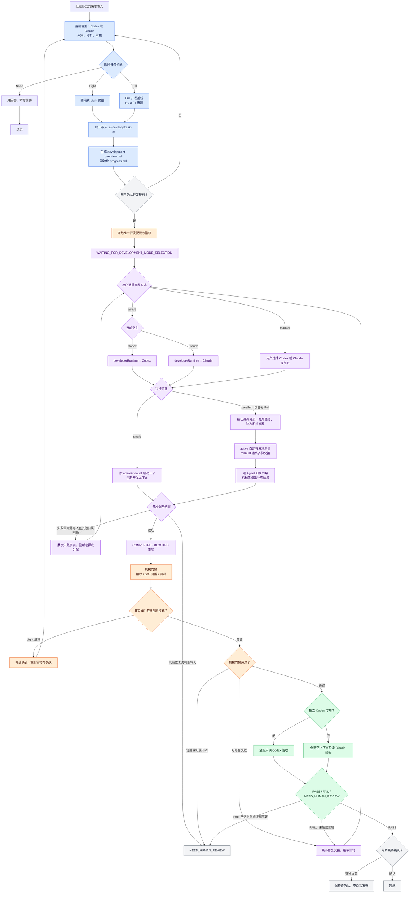

# 工作流程图

## 阅读重点

- 所有产物统一放在 `.ai-dev-loop/<task-id>/`，CLI 缺失也不改变目录。
- `development-overview.md` 提供稳定任务地图，`progress.md` 在每次状态转换后更新，人工验收从这两个入口查看。
- 需求确认与开发方式选择是两个门禁；冻结后必须由用户明确选择 active 或 manual。
- active 使用宿主同类开发运行时：Codex 启动 Codex，Claude 启动 Claude。
- manual 是正式路径，可把冻结包跨工具交给全新 Codex 或 Claude。
- single/parallel 是独立执行拓扑；只有任务和写入范围可证明互斥的 Full 才能选择 parallel。
- 用户确认 active + parallel 计划后自动派遣，不再逐 Agent 询问；计划变化必须重新确认。
- parallel 先逐 Agent 检查归属并集成，再对最终聚合 diff 运行完整门禁和独立验收。
- 主动调用失败且确认零写入时重新请求选择并推荐 manual；不得自动切换。
- 两种开发方式共用相同冻结授权、机械门禁和独立验收。
- `PASS` 仍需用户最终确认。
