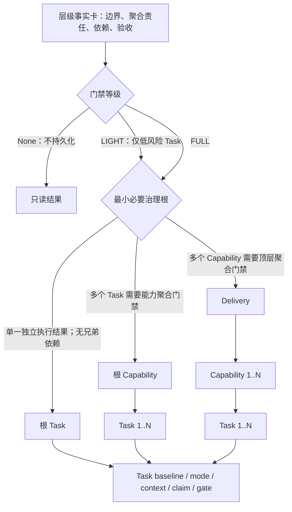
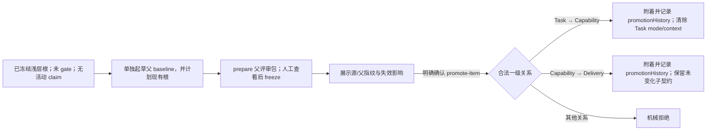
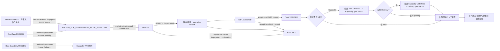

# 分层交付工作流

## 主流程

1. 从当前 Skill 安装目录运行 `node <skill-root>/scripts/hdg.mjs --help`。全局 `hdg` 不是前置条件。
2. 只读恢复 registry；不存在时表示尚未持久化工作项。遇到受支持的单根 schema v2 Task 时，先展示迁移影响和 gateLevel，明确确认后执行 `upgrade-registry`，再按 v3 恢复；不得因新会话而忽略旧现场，也不得静默迁移。
3. 起草层级事实卡，选择能够承担当前聚合责任的最浅根：Task、Capability 或 Delivery；同时选择不持久化的 `None`，或 schema v3 工作项的 `LIGHT|FULL`。只有 Task 可为 `LIGHT`。为实际层级起草对应 `developmentPlan`：Task 精确到文件、接口与逻辑；Capability 精确到 Task 内容、共享契约和波次；Delivery 精确到 Capability 内容、跨能力契约和波次。
4. 运行 `prepare-item`，生成 `development-review.md` 和 `development-plan.json`，向用户提供可点击文件与当前指纹。此时状态保持 `WAITING_FOR_BASELINE_CONFIRMATION`，不授权开发。
5. 人工评审后，需要修改就重新起草和准备；明确同意当前评审文件与指纹后，才执行 `freeze-item --confirmed`。CLI 不提供原子 prepare+freeze 命令。
6. 如果已有浅层根后来需要真实聚合父级，先单独准备、人工评审并冻结计划该根的父 baseline，再展示双方指纹并取得明确升层确认；`promote-item` 只附着 `Task→Capability` 或 `Capability→Delivery`，不自动创建/冻结父级。
7. Task 冻结或升层后进入 `WAITING_FOR_DEVELOPMENT_MODE_SELECTION`，等待用户明确选择 active/manual。
8. 内置控制器持久化并校验 `development-mode.json` 后，才计算 READY；正常流程用 `dispatch-task` 原子认领并生成绑定 operationId 的独立上下文。manual 模式必须把返回的 `handoffPrompt` 原样展示，不能只给文件链接。
9. 开发 Agent 返回实现事实或 BLOCKED；宿主用 operationId 执行 `task-result`。IMPLEMENTED 后立即生成“等待门禁验收”报告，宿主继续形成严格 evidence 并执行 `accept-item`，不得在开发完成处停止。
10. 若存在 Capability，全部 Task VERIFIED 后运行 Capability 聚合门禁；若存在 Delivery，全部 Capability VERIFIED 后运行 Delivery 聚合门禁。
11. 任意治理根 gate PASS 后完成隔离/人工审查，再由用户确认最终交付；同一份用户验收报告持续更新至“已完成”。

任何步骤都不能从自然语言关键词推导创建、冻结或修订授权。

## 层级路由图

不允许 `Delivery → Task` 或 `Capability → Capability`。根 Task 需要兄弟 Task 依赖时升级为根 Capability；根 Capability 需要兄弟 Capability 依赖时升级为 Delivery。

## 受控升层图

升层保留源 ID、kind 和 gateLevel。任何指纹过期、父未计划源、父未冻结、源/父已运行 gate 或源子树存在活动 claim，都返回阻断并要求重新确认当前事实。

## 生命周期图

READY 是派生谓词，不写入 lifecycle。协调工作项的 VERIFIED 不是子级状态别名：子级全部 VERIFIED 只是运行自身 gate 的前置条件；decomposition 也必须先显式 SEALED。

## 恢复与修订

恢复优先级固定为：用户给出的精确 ID/包路径、有效 `currentFocus.workItemId`、唯一非终态候选；多个候选时请用户选择。恢复后验证包指纹、实际父链、依赖、claim 和工作区授权。

同一 `.hierarchical-delivery-governance` 中的 schema v2 单根 Task 属于版本兼容恢复，不是新工作项。只有它已经冻结、没有活动 claim、未运行 gate、磁盘包与 registry 指纹一致时，才允许以明确选择的 `LIGHT|FULL` 执行 `upgrade-registry --confirmed`。迁移保留 ID、状态和已确认开发方式，重算指纹、记录审计历史，并删除旧指纹绑定的 context/handoff；之后必须重新 `dispatch-task` 生成提示词。多工作项、层级树、已产生开发结果或 gate 证据的 v2 现场保持阻断并报告人工迁移需求。

修订必须携带当前 baseline 指纹和显式确认。新增兄弟子项不影响未变化子项；父稳定契约或目标子契约变化只使对应后代 stale。已 VERIFIED 工作项不能直接修订。

## 失败关闭

- 基线或开发方案不完整：不准备包；评审文件未生成或当前指纹未确认：不冻结；
- 未明确选择开发方式：不生成上下文、不认领；
- Skill 内置控制器缺失或校验失败：报告 Skill 安装损坏，不要求另装全局 CLI，不用对话模拟硬门禁；
- 父链漂移、依赖未验证或范围冲突：Task 不 READY；
- 测试或证据缺失：gate 不 PASS；
- 无独立语义审查能力：治理根保持 `WAITING_FOR_INDEPENDENT_REVIEW`；
- 未取得用户确认：不得把治理根标为 `COMPLETED`；
- 外部状态变更未授权：停止并请求授权。
