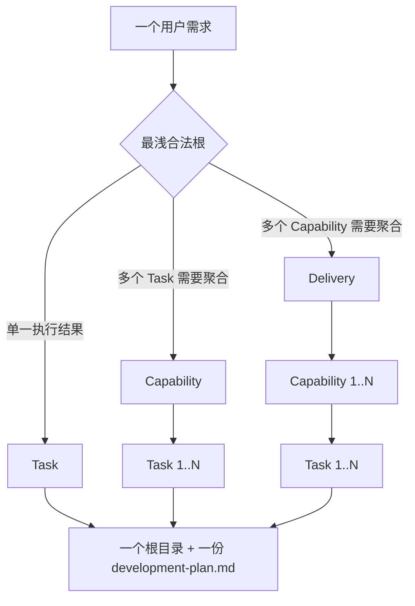
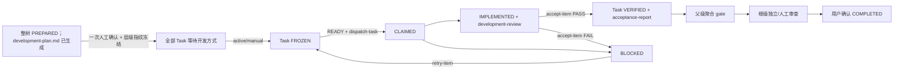

# 分层交付工作流

## 主流程

1. 从当前 Skill 安装目录运行 `python -X utf8 <skill-root>/scripts/hdg.py --help`。Python 3.10+ 是唯一运行时，不要求 Node、npm 或第三方包。
2. 只读恢复当前 schema v3 registry 和每个需求根的 `hierarchy.json`。字段、指纹、完整树或磁盘投影不一致时保持阻断，不迁移、不猜测。
3. 起草层级事实卡，选择最浅合法形态：独立 Task、Capability→Task 或 Delivery→Capability→Task。为每个实际节点起草自己的 baseline 与 `developmentPlan`。
4. 把整棵需求树组织成 `{"schemaVersion":3,"root":{"definition":{...},"children":[...]}}`。协调节点声明的每个 child 必须在这棵树里完整物化。
5. 运行 `prepare-hierarchy`。一个需求只生成 `work-items/<root-id>/` 一个顶层目录，子节点按 `children/<id>/` 递归嵌套；根级 `development-plan.md` 一次展示完整树。
6. 人工查看根级 `development-plan.md`。需要修改就重新准备整棵树；同意时只需回复“已评审并同意当前开发方案”，无需知道或复述指纹。
7. Agent 使用准备结果中保存的 `hierarchyFingerprint` 调用 `freeze-hierarchy --expected-hierarchy ... --confirmed`。控制器一次冻结全部节点；指纹已变化则自动拒绝旧确认。
8. 每个 Task 分别等待用户选择 active/manual；选择后才允许 `dispatch-task` 生成 operationId、独立上下文和 handoff。
9. 开发结果由 `task-result` 写回。此时生成 `development-review.json/md`，对照冻结计划与实际改动、接口和测试，但不代表 PASS。
10. 宿主形成严格 gate evidence 并执行 `accept-item`。门禁阶段生成 `acceptance-report.json/md`；Task 全部 VERIFIED 后依次运行 Capability、Delivery 自身聚合门禁。
11. 治理根 gate PASS 后完成隔离/人工审查，再由用户确认最终交付；验收报告持续更新至 `COMPLETED`。

任何步骤都不能从“优化、开发、项目、治理”等自然语言关键词推导创建或冻结授权。

## 层级与目录



```text
work-items/
└── <root-id>/
    ├── hierarchy.json
    ├── development-plan.md
    ├── baseline.*
    └── children/
        └── <child-id>/
            ├── baseline.*
            └── children/...
```

不允许 `Delivery → Task`、`Capability → Capability`、平铺子包或只声明不物化的 child。

## 生命周期



READY 是派生谓词，不写入 lifecycle。协调工作项必须在全部直接子级 VERIFIED 后运行自己的 gate，不能把子级完成等同于父级 PASS。

## 恢复与失败关闭

- 恢复优先使用用户给出的精确 ID/路径、有效焦点或唯一候选；多个候选时请求选择。
- `development-plan.md`、`hierarchy.json`、任一 baseline/state 被篡改时拒绝冻结或调度。
- 未明确选择开发方式时不生成可执行上下文。
- 父链漂移、依赖未验证或范围冲突时 Task 不 READY。
- 测试或证据不足时 gate 不 PASS。
- 没有独立审查能力时根保持等待人工审查。
- 未取得用户确认时不得标记 `COMPLETED`。
