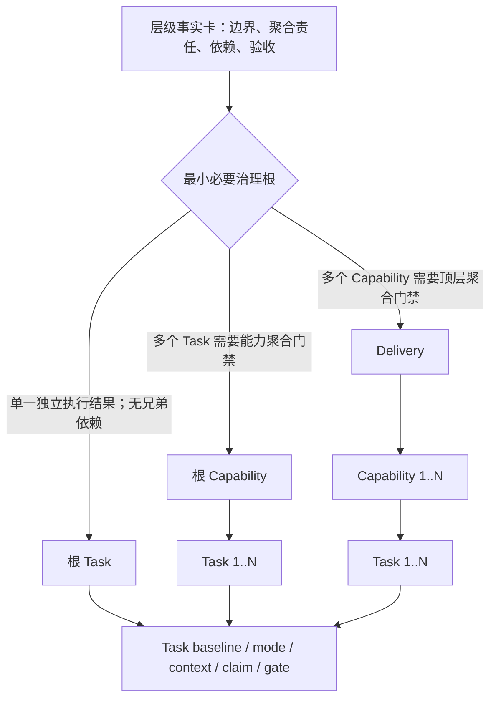
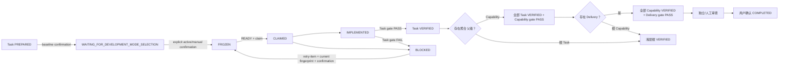

# 分层交付工作流

## 主流程

1. 先判断是否为本 Skill 的 self-hosting maintenance；没有明确 dogfood 时短路运行包流程。
2. 从当前 Skill 安装目录运行 `node <skill-root>/scripts/hdg.mjs --help`。全局 `hdg` 不是前置条件。
3. 只读恢复 registry；不存在时表示尚未持久化工作项。
4. 起草层级事实卡，选择能够承担当前聚合责任的最浅根：Task、Capability 或 Delivery。
5. 用户批准具体 ID、baseline 内容和持久化后，逐级准备实际存在的工作项；每次冻结仍需单独确认。
6. Task 冻结后进入 `WAITING_FOR_DEVELOPMENT_MODE_SELECTION`，等待用户明确选择 active/manual。
7. 内置控制器持久化并校验 `development-mode.json` 后，才计算 READY、生成独立上下文并原子认领。
8. 开发 Agent 返回实现事实或 BLOCKED；宿主运行 Task 门禁。
9. 若存在 Capability，全部 Task VERIFIED 后运行 Capability 聚合门禁；若存在 Delivery，全部 Capability VERIFIED 后运行 Delivery 聚合门禁。
10. Delivery gate PASS 后完成隔离/人工审查，再由用户确认最终交付。浅层根在自身 gate PASS 后为 VERIFIED。

任何步骤都不能从自然语言关键词推导“创建、冻结、修订或 dogfood”授权。

## 层级路由图

不允许 `Delivery → Task` 或 `Capability → Capability`。根 Task 需要兄弟 Task 依赖时升级为根 Capability；根 Capability 需要兄弟 Capability 依赖时升级为 Delivery。

## 生命周期图

READY 是派生谓词，不写入 lifecycle。协调工作项的 VERIFIED 不是子级状态别名：子级全部 VERIFIED 只是运行自身 gate 的前置条件；decomposition 也必须先显式 SEALED。

## 恢复与修订

恢复优先级固定为：用户给出的精确 ID/包路径、有效 `currentFocus.workItemId`、唯一非终态候选；多个候选时请用户选择。恢复后验证包指纹、实际父链、依赖、claim 和工作区授权。

修订必须携带当前 baseline 指纹和显式确认。新增兄弟子项不影响未变化子项；父稳定契约或目标子契约变化只使对应后代 stale。已 VERIFIED 工作项不能直接修订。

## 失败关闭

- 基线不完整：不准备包；未确认：不冻结；
- 未明确选择开发方式：不生成上下文、不认领；
- Skill 内置控制器缺失或校验失败：报告 Skill 安装损坏，不要求另装全局 CLI，不用对话模拟硬门禁；
- 父链漂移、依赖未验证或范围冲突：Task 不 READY；
- 测试或证据缺失：gate 不 PASS；
- 无独立语义审查能力：Delivery 保持 `WAITING_FOR_INDEPENDENT_REVIEW`；
- 未取得用户确认：不得把 Delivery 标为 `COMPLETED`；
- 外部状态变更未授权：停止并请求授权。
