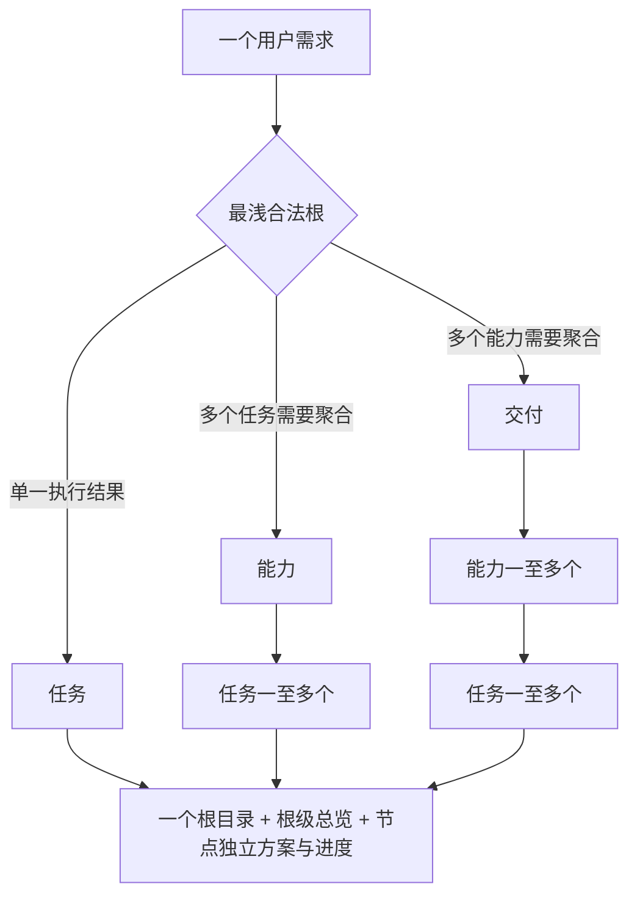
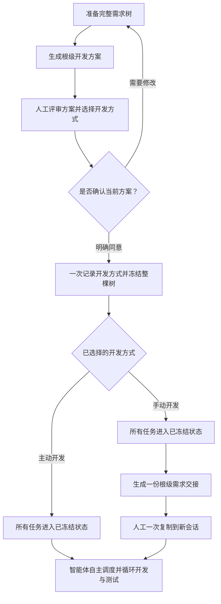
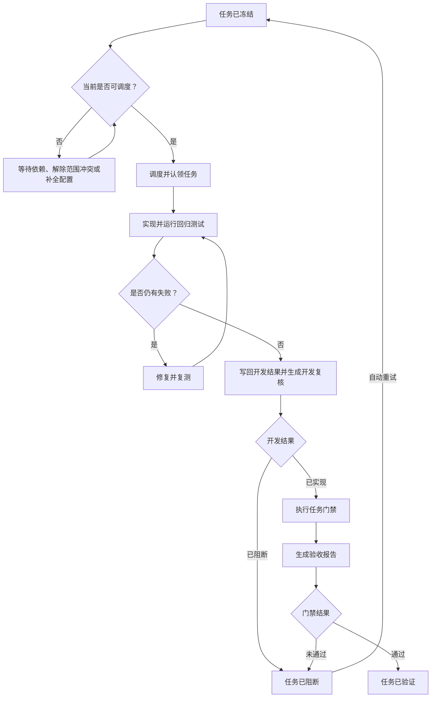
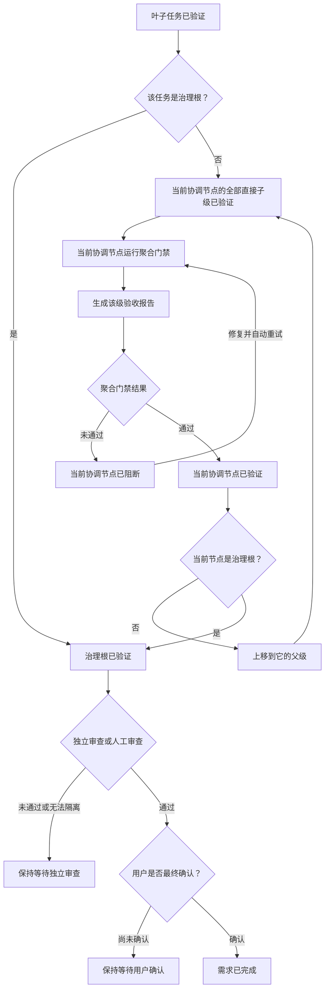

# 分层交付工作流

## 主流程

1. 从当前 Skill 安装目录运行 `python -X utf8 <skill-root>/scripts/hdg.py --help`。Python 3.10+ 是唯一运行时，不要求 Node、npm 或第三方包。
2. 只读恢复项目级 `governance.sqlite3`。数据库 schema、字段、指纹或完整树不一致时保持阻断，不迁移、不猜测；Markdown 缺失时可从数据库刷新。
3. 起草层级事实卡，选择最浅合法形态：独立 Task、Capability→Task 或 Delivery→Capability→Task。为每个实际节点起草自己的 baseline 与 `developmentPlan`。
4. 把整棵需求树组织成 `{"schemaVersion":3,"root":{"definition":{...},"children":[...]}}`。协调节点声明的每个 child 必须在这棵树里完整物化。
5. 运行 `prepare-hierarchy`。一个需求只生成 `work-items/<root-id>/` 一个顶层目录，子节点按 `children/<id>/` 递归嵌套；根级 `development-plan.md/progress.md` 聚合完整树，每个实际子节点也生成自己的 `development-plan.md/progress.md`。
6. 人工查看根级 `development-plan.md`，同时选择 active/manual。需要修改就重新准备整棵树；同意时只需确认当前方案和所选方式，无需知道或复述指纹。
7. Agent 使用准备结果中的 `hierarchyFingerprint`，调用一次 `freeze-hierarchy --expected-hierarchy ... --development-mode ... --confirmed`。控制器在同一事务中记录方式并冻结全部节点；指纹已变化则拒绝旧确认。
8. active 下由当前 Agent 冻结后直接自主推进；manual 在需求根生成一份 `requirement-handoff.md`，用户只需一次复制到新会话，接收 Agent 即成为整树执行宿主。两种宿主都自主决定多子 Agent、单 Agent 或当前 Agent 串行，循环实现、回归、修复和复测；运行能力变化时自动调整，不再次询问开发方式或要求人工逐 Task 启动。
9. 开发结果由 `task-result` 写回 SQLite 并生成 `development-review.md`，对照冻结计划与实际改动、接口和测试，但不代表 PASS。
10. 全部相关回归和复测通过后，宿主形成严格 gate evidence 并执行 `accept-item`。结构化验收记录写入 SQLite，门禁阶段生成 `acceptance-report.md`；Task 全部 VERIFIED 后依次运行 Capability、Delivery 自身聚合门禁。
11. 治理根 gate PASS 后向用户提交交付，由用户人工验收并确认；验收报告持续更新至 `COMPLETED`。

任何步骤都不能从“优化、开发、项目、治理”等自然语言关键词推导创建或冻结授权。

## 层级与目录



```text
governance.sqlite3
work-items/
└── <root-id>/
    ├── development-plan.md
    ├── progress.md
    ├── interaction-log.md
    ├── requirement-handoff.md  # 仅 manual 冻结后生成
    ├── baseline.md
    └── children/
        └── <child-id>/
            ├── baseline.md
            ├── development-plan.md
            ├── progress.md
            └── children/...
```

不允许 `Delivery → Task`、`Capability → Capability`、平铺子包或只声明不物化的 child。

## 生命周期

生命周期按职责拆成三段阅读，不把整条状态机挤进一张横向图。

### 1. 整树准备与冻结



人工在同一次前期评审中确认当前根级计划和开发方式；层级指纹由 Agent 和控制器绑定，无需人工复述。manual 的“一次交接”不表示一次认领全部 Task：接收会话仍按依赖即时认领各 Task，但不再让人逐个转交。Agent 数量、并发度、调度顺序和降级路径由执行宿主决定，不进入冻结方案。

### 2. 单个任务的开发与门禁



“可调度”是实时计算结果，不写入持久化生命周期。“已实现”只表示开发结果已回收，必须继续执行门禁。实际机械命令依次为 `dispatch-task`、`task-result`、`accept-item` 和 `retry-item`。

### 3. 父级聚合与最终完成



能力和交付都必须在全部直接子级已验证后运行自己的聚合门禁，不能把子级完成等同于父级通过。门禁失败时按当前层级修复并重试，不进入最终确认。

## 恢复与失败关闭

- 恢复优先使用用户给出的精确 ID/路径、有效焦点或唯一候选；多个候选时请求选择。
- 冻结前 `development-plan.md` 被篡改，或 SQLite 中任一 hierarchy/baseline/state 记录不一致时拒绝冻结或调度。
- 人工未在冻结确认中明确选择开发方式时拒绝冻结，不生成可执行上下文。
- 父链漂移、依赖未验证或范围冲突时 Task 不 READY。
- 测试或证据不足时 gate 不 PASS。
- 没有独立审查能力时根保持等待人工审查。
- 未取得用户确认时不得标记 `COMPLETED`。
